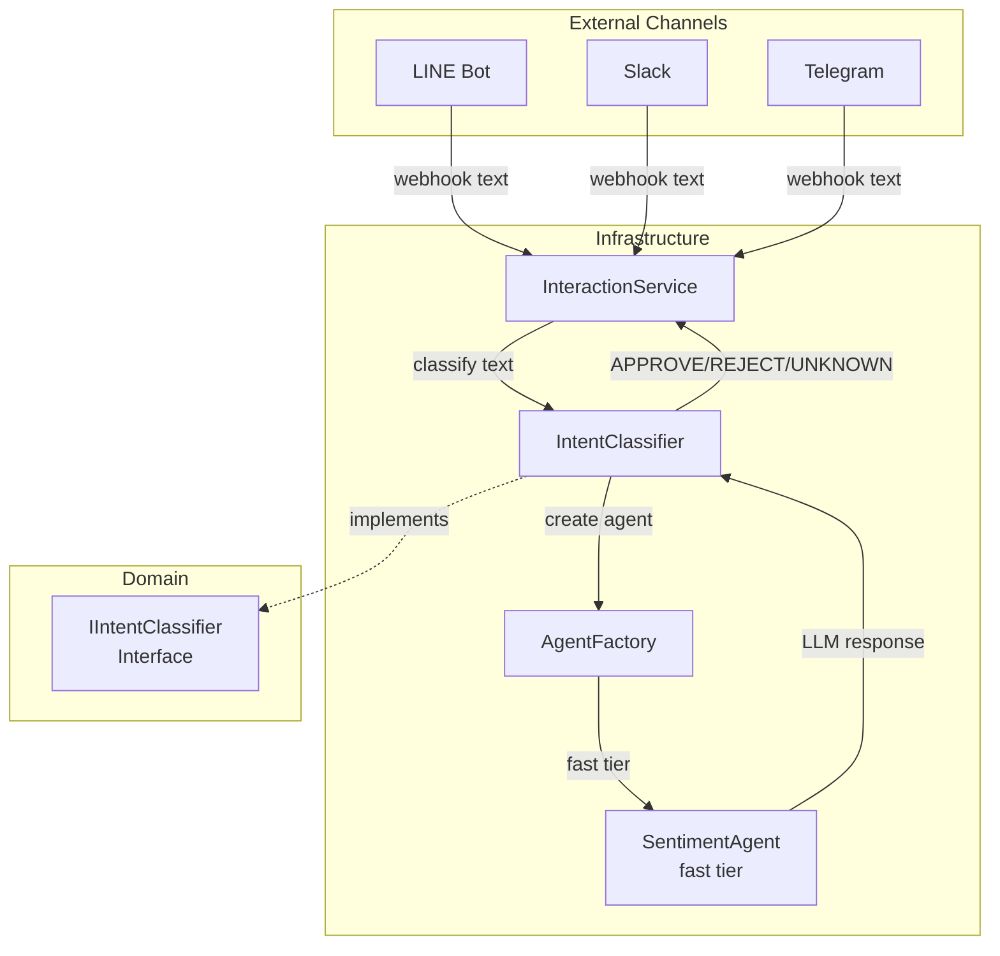
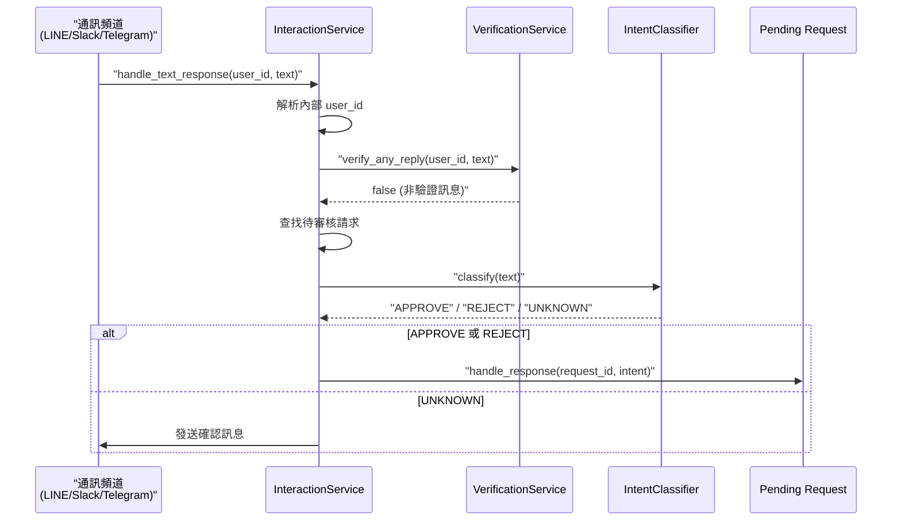

# 意圖分類與 NLP 引擎 (Intent Classification & NLP Engine)

### 版本紀錄 (Version History)
| Date | Version | Description | Author |
| :--- | :--- | :--- | :--- |
| 2026-02-21 | v1.0 | 初版：涵蓋 IntentClassifier 設計、意圖類型與 InteractionService 整合 | Antigravity |

---

## 🇹🇼 概述

意圖分類器（`IntentClassifier`）是系統 NLP 基礎設施的核心元件，位於 `src/infrastructure/nlp/` 目錄下。它負責將使用者的自然語言回覆分類為結構化的意圖（Intent），使系統能夠自動處理審核流程中的使用者回應。

### 設計理念

1. **混合分類策略**：結合關鍵字快速匹配與 LLM 深度理解，兼顧速度與準確度。
2. **介面抽象**：實作 `IIntentClassifier` 介面，支援未來替換為其他 NLP 引擎。
3. **輕量級 LLM**：使用 `fast` 層級的 Agent（SentimentAgent），而非昂貴的 `smart` 層級。
4. **容錯設計**：任何異常都回傳 `UNKNOWN`，不會中斷上層流程。

---

## 架構定位 (Architecture Context)



---

## 核心類別 (Core Class)

### `IntentClassifier`

**檔案位置**：[`src/infrastructure/nlp/intent_classifier.py`](intent_classifier.py)

**實作介面**：`IIntentClassifier`（定義於 `src/domain/interfaces.py`）

#### 建構子

```python
class IntentClassifier(IIntentClassifier):
    def __init__(self):
        self.agent = AgentFactory.create_agent(
            "Sentiment", 
            tier="fast", 
            user_id="system",
            use_cache=True
        )
```

使用 `AgentFactory` 建立一個 `fast` 層級的 SentimentAgent，啟用快取以減少重複的 LLM 呼叫。

#### 分類方法

| 方法 | 簽名 | 說明 |
| :--- | :--- | :--- |
| `classify` | `(text: str) -> str` | 分類使用者文字，回傳意圖字串 |

---

## 支援的意圖類型 (Supported Intents)

| 意圖 | 值 | 觸發條件 | 說明 |
| :--- | :--- | :--- | :--- |
| ✅ 核准 | `APPROVE` | 使用者同意、確認、說「執行」 | 觸發待審核操作的執行 |
| ❌ 拒絕 | `REJECT` | 使用者拒絕、取消、說「不執行」 | 取消待審核操作 |
| ❓ 未知 | `UNKNOWN` | 無法判斷意圖或發生錯誤 | 不觸發任何操作 |

---

## 分類流程 (Classification Pipeline)

```mermaid
flowchart TD
    INPUT[使用者文字輸入] --> KW{關鍵字快速匹配}
    
    KW -->"|含「執行」且不含「不」| APPROVE_FAST[回傳 APPROVE]"
    KW -->"|含「不執行」或「取消」| REJECT_FAST[回傳 REJECT]"
    KW -->"|無匹配| LLM[呼叫 LLM 分類]"
    
    LLM --> PARSE{解析 LLM 回應}
    PARSE -->"|含 APPROVE| APPROVE_LLM[回傳 APPROVE]"
    PARSE -->"|含 REJECT| REJECT_LLM[回傳 REJECT]"
    PARSE -->"|其他| UNKNOWN[回傳 UNKNOWN]"
    
    LLM -->"|Exception| UNKNOWN_ERR[回傳 UNKNOWN]"

    style APPROVE_FAST fill:#10b981,color:#fff
    style APPROVE_LLM fill:#10b981,color:#fff
    style REJECT_FAST fill:#ef4444,color:#fff
    style REJECT_LLM fill:#ef4444,color:#fff
    style UNKNOWN fill:#6b7280,color:#fff
    style UNKNOWN_ERR fill:#6b7280,color:#fff
```

### 第一階段：關鍵字快速匹配

在呼叫 LLM 之前，先進行低成本的關鍵字檢查：

| 規則 | 條件 | 結果 |
| :--- | :--- | :--- |
| 中文核准 | 含「執行」且不含「不」 | `APPROVE` |
| 中文拒絕 | 含「不執行」或「取消」 | `REJECT` |

### 第二階段：LLM 深度分類

若關鍵字無法匹配，則使用 Prompt 引導 LLM 進行分類：

```
TASK: Classify the user's response to an approval request.
USER RESPONSE: "{text}"
INSTRUCTIONS:
- If the user consents, agrees, confirms, or says "執行", return "APPROVE".
- If the user denies, disagrees, cancels, or says "不執行", return "REJECT".
- If the response is unrelated or unclear, return "UNKNOWN".
- Return ONLY the classification string.
```

LLM 回應經過 `.strip().upper()` 正規化後，檢查是否包含 `APPROVE` 或 `REJECT`。

---

## 與 InteractionService 的整合

`IntentClassifier` 透過依賴注入整合到 `InteractionService` 中，處理來自各通訊頻道的使用者回覆。

### 整合流程



### 注入方式

```python
from src.infrastructure.nlp.intent_classifier import IntentClassifier

interaction_service = InteractionService(
    adapters=[line_adapter],
    intent_classifier=IntentClassifier(),  # 依賴注入
    settings_service=settings_service
)
```

### 處理邏輯

1. **使用者身分解析**：透過 `SettingsService.find_user_by_channel_id()` 將頻道 ID 映射到系統使用者。
2. **驗證優先**：先檢查是否為頻道綁定驗證訊息（`VerificationService`）。
3. **待審核匹配**：查找該使用者最新的待審核請求。
4. **意圖分類**：呼叫 `IntentClassifier.classify()` 判斷使用者意圖。
5. **操作執行**：若為 `APPROVE` 或 `REJECT`，觸發對應的審核流程處理。

---

## 擴展指南 (Extension Guide)

### 新增意圖類型

若需支援更多意圖（如 `MODIFY`、`DEFER`），需修改：

1. **`IntentClassifier.classify()`**：更新 Prompt 與回應解析邏輯
2. **`InteractionService.handle_text_response()`**：新增對應的處理分支
3. **關鍵字表**：在快速匹配階段加入新的中文/英文關鍵字

### 替換 NLP 引擎

由於使用 `IIntentClassifier` 介面，可輕鬆替換為：
- **本地模型**：使用 Hugging Face Transformers 的 zero-shot classification
- **外部 API**：整合 Dialogflow、Rasa 等 NLU 服務
- **規則引擎**：純正則表達式匹配（適用於簡單場景）

---

## 🇺🇸 Summary (English)

The **Intent Classifier** (`src/infrastructure/nlp/intent_classifier.py`) is the NLP engine responsible for classifying user natural language responses into structured intents (`APPROVE`, `REJECT`, `UNKNOWN`). It implements the `IIntentClassifier` interface and uses a **hybrid classification strategy**:

1. **Keyword Fast-Match**: Low-cost Chinese keyword detection (e.g., "執行" → APPROVE, "取消" → REJECT).
2. **LLM Deep Classification**: Falls back to a `fast`-tier SentimentAgent for ambiguous inputs.

The classifier integrates with `InteractionService` via dependency injection, enabling automated approval workflows across LINE, Slack, and Telegram channels. All errors gracefully degrade to `UNKNOWN` to prevent workflow disruption.

## 🔗 Bidirectional Links
- **Interaction Service**: [[通知微服務架構-Notification-Microservice-Architecture]]
- **Agent Factory**: [[代理人戰略協定-Agent-Swarm-Protocol]]
- **Channel Adapters**: [[全通路適配器規範-Omni-Channel-Adapter-Standards]]
- **Domain Interfaces**: [[資料與領域模型-Data-Domain-Models]]
- **Agent Skills**: [[Agent技能系統-Agent-Skills-System]]
