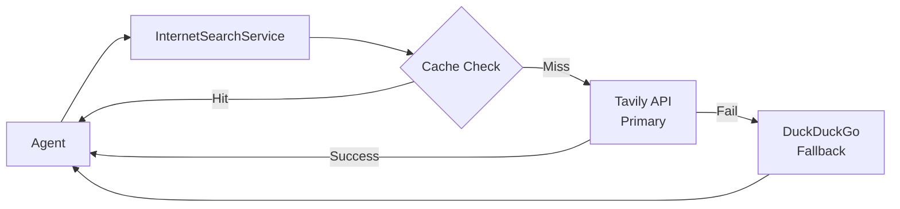

# 搜尋服務架構 (Search Service Architecture)

本文件說明系統的網路搜尋服務架構，採用雙層設計提供穩定的資訊檢索能力。
This document describes the web search service architecture using a two-tier design for reliable information retrieval.

## 1. 架構概觀 (Architecture Overview)



## 2. 雙層搜尋策略 (Two-Tier Strategy)

| 層級 | 服務 | 說明 |
|---|---|---|
| **主要 (Primary)** | Tavily API | AI 優化的搜尋 API，JSON 輸出，穩定性高 |
| **備援 (Fallback)** | DuckDuckGo | 免費無限制，但有超時風險 |

### 2.1 Tavily 優勢 (Tavily Advantages)

- ✅ **AI Agent 優化**: 專為 LLM 應用設計
- ✅ **JSON 格式輸出**: 結構化資料，易於解析
- ✅ **高穩定性**: 企業級 SLA
- ✅ **免費額度**: 每月 1,000 次搜尋

### 2.2 DuckDuckGo 限制 (DuckDuckGo Limitations)

- ⚠️ **Rate Limiting**: 高頻率使用可能被封鎖
- ⚠️ **超時風險**: 網路狀況不穩定時容易超時
- ⚠️ **無官方 API**: 依賴 HTML 解析

## 3. 環境設定 (Configuration)

```bash
# .env
TAVILY_API_KEY=tvly-xxxxxxxxxxxxx
```

> [!IMPORTANT]
> 若未設定 `TAVILY_API_KEY`，系統將自動降級至 DuckDuckGo。
> Without `TAVILY_API_KEY`, the system falls back to DuckDuckGo automatically.

## 4. 快取機制 (Caching)

- **TTL**: 預設 24 小時 (`cache_ttl=86400`)
- **策略**: 記憶體快取，以查詢字串為 Key
- **效益**: 減少 API 呼叫次數，降低成本

## 5. 相關檔案 (Related Files)

- [src/services/search_service.py](../../src/services/search_service.py) - 搜尋服務實作
- [第三方服務設定](../03_開發者指南-Developer_Guide/第三方服務設定-3rd-Party-Services-Setup.md) - API Key 設定

---
*Last Updated: 2026-01-04*
