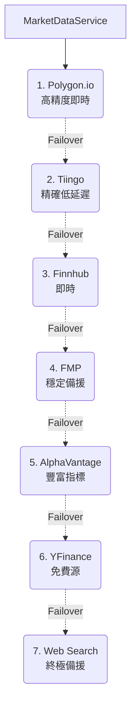

# 數據攝取架構 (Data Ingestion Architecture)

## 版本紀錄 (Version History)

| Date | Version | Description | Author |
| :--- | :--- | :--- | :--- |
| 2026-03-08 | v2.3 | 整合 FinancialDataProvider 並落實標準化金鑰命名 | Antigravity |
| 2026-02-27 | v2.2 | 標準化 Fred, Finnhub, AlphaVantage 提供者介面 | Antigravity |
| 2026-02-27 | v2.1 | 整合 Polygon WebSocket 串流與 OTel 自動追蹤裝飾器 | Antigravity |
| 2026-02-21 | v2.0 | 新增 EtoroIngestor、Data Providers 層、策略模式完整圖表 | Antigravity |
| 2026-02-18 | v1.0 | Initial Release: Documented `IngestorFactory` and `Strategy` patterns for broker-specific parsing. | Neo |

---

<a id="zh"></a>

## 🇹🇼 數據攝取架構 (Overview)

本專案採用 **策略模式 (Strategy Pattern)** 來處理來自不同券商 (Robinhood, IBKR, eToro) 的原始交易數據。攝取層的核心目標是將非結構化的 CSV 或 API 反應轉化為系統統一的 `Transaction` 實體。

此外，系統透過 **Data Providers 層** 提供多來源的市場數據獲取能力，支援 yfinance、FMP 和 Polygon.io 三種數據提供者。

### 架構全景圖

```mermaid
graph TB
    subgraph 使用者輸入 User Input
        CSV[CSV 檔案上傳]
        API_IN[API 匯入]
    end

    subgraph 攝取層 Ingestion Layer
        TI[TradeIngestor<br>src/data/ingestor.py<br>Legacy]
        IF[IngestorFactory<br>src/data/ingestors/factory.py]
        
        subgraph 策略實作 Strategies
            SI[SimpleIngestor]
            RI[RobinhoodIngestor]
            II[IBKRIngestor]
            EI[EtoroIngestor]
        end
        
        BI[BaseIngestor<br>src/data/ingestors/base.py]
    end

    subgraph 市場數據提供者 Data Providers
        MDP[MarketDataProvider<br>base.py]
        YFP[YFinanceProvider]
        FMPP[FMPProvider]
        POLYP[PolygonProvider]
        TINP[TiingoProvider]
        FINP[FinnhubProvider]
        FREDP[FredProvider]
        AVP[AlphaVantageProvider]
        FINDP[FinancialDataProvider]
    end

    subgraph 即時數據 Real-time
        PWS[PolygonStreamClient<br>WebSocket]
    end

    subgraph 持久化 Persistence
        TR[TransactionRepository]
        DB["(PostgreSQL")]
    end

    subgraph 外部 API
        YF_API[yfinance]
        FMP_API[FMP API]
        POLY_API[Polygon.io API]
        TIN_API[Tiingo API]
        FIN_API[Finnhub API]
        FRED_API[FRED API]
        AV_API[AlphaVantage API]
    end

    CSV --> IF
    API_IN --> IF
    IF --> SI
    IF --> RI
    IF --> II
    IF --> EI
    SI --> BI
    RI --> BI
    II --> BI
    EI --> BI
    SI --> DB
    RI --> DB
    II --> DB
    EI --> DB

    YFP --> MDP
    FMPP --> MDP
    POLYP --> MDP
    TINP --> MDP
    FINP --> MDP
    FREDP --> MDP
    AVP --> MDP

    PWS --> SS
    YFP --> YF_API
    FMPP --> FMP_API
    POLYP --> POLY_API
    TINP --> TIN_API
    FINP --> FIN_API
    FREDP --> FRED_API
    AVP --> AV_API
    FINDP --> FD_API[FinancialData.Net API]
```

---

## 1. 核心組件 (Core Components)

### 1.1 攝取器工廠 (IngestorFactory)

位於 [`src/data/ingestors/factory.py`](factory.py)。

| 項目 | 說明 |
| :--- | :--- |
| **職責** | 根據傳入的券商名稱，動態建立對應的實作類別 |
| **模式** | Factory Pattern |
| **支援類型** | `simple`, `robinhood`, `ibkr`, `etoro` |

```python
class IngestorFactory:
    @staticmethod
    def get_ingestor(broker_name: str, db_path: str) -> BaseIngestor:
        # 'simple' → SimpleIngestor
        # 'robinhood' → RobinhoodIngestor
        # 'ibkr' → IBKRIngestor
        # 'etoro' → EtoroIngestor
```

### 1.2 基礎攝取器 (BaseIngestor)

位於 [`src/data/ingestors/base.py`](base.py)。

```python
class BaseIngestor(ABC):
    def __init__(self, db_path: str): ...
    
    @abstractmethod
    def ingest(self, df: pd.DataFrame, user_id: str) -> None: ...
```

所有策略實作必須實現 `ingest()` 方法，接收 Pandas DataFrame 和使用者 ID。

---

## 2. 策略實作 (Ingestion Strategies)

位於 [`src/data/ingestors/strategies.py`](strategies.py)。

### 2.1 SimpleIngestor — 標準化模板匯入

| 項目 | 說明 |
| :--- | :--- |
| **來源格式** | 標準 CSV（`ticker`, `quantity`, `price`） |
| **支援欄位** | `ticker`, `quantity`, `price`/`cost`, `action`, `date`, `fees`, `leverage` |
| **預設 Action** | `BUY` |
| **特殊處理** | `cost` 自動映射為 `price`（向後相容） |

**支援的 Action 類型**：`BUY`, `SELL`, `DIVIDEND`, `DEPOSIT`, `WITHDRAW`

**額外功能**：

- 自動將 `DEPOSIT`/`WITHDRAW` 同步至 `cash_flows` 表
- 將 `leverage` 等額外資訊儲存至 `raw_data` JSON 欄位

### 2.2 RobinhoodIngestor — Robinhood 匯入

| 項目 | 說明 |
| :--- | :--- |
| **來源格式** | Robinhood 匯出 CSV |
| **欄位映射** | `symbol`/`ticker` → ticker, `side` → action |
| **Action 邏輯** | `side='buy'` → `BUY`, 其他 → `SELL` |
| **來源標記** | `source_file = 'robinhood_import'` |

### 2.3 IBKRIngestor — Interactive Brokers 匯入

| 項目 | 說明 |
| :--- | :--- |
| **來源格式** | IBKR Activity Statement CSV |
| **欄位映射** | `symbol` → ticker, `t. price` → price, `comm/fee` → fees |
| **日期格式** | `"2023-10-27, 09:30:00"` → 提取日期部分 |
| **支援類型** | `Trade`（買賣）、`Dividend`（股息） |
| **特殊處理** | 負數量 → `SELL`，費用取絕對值 |

### 2.4 EtoroIngestor — eToro 匯入 ⭐ 新增

| 項目 | 說明 |
| :--- | :--- |
| **來源格式** | eToro Financial Statement CSV |
| **欄位映射** | `Date` → `trade_date`, `Type` → `action`, `Amount` → `amount`, `Units` → `quantity`, `Asset` → `ticker` |
| **必填欄位** | `trade_date`, `action`, `quantity`, `amount` |
| **來源標記** | `source_file = 'csv_etoro'` |

**Action 正規化邏輯**：

| eToro 原始值 | 正規化結果 |
| :--- | :--- |
| 含 `DEPOSIT` | `DEPOSIT` |
| 含 `WITHDRAW` | `WITHDRAWAL` |
| 含 `BUY` 或 `OPEN` | `BUY` |
| 含 `SELL` 或 `CLOSE` | `SELL` |
| 含 `DIVIDEND` | `DIVIDEND` |

**特殊功能**：

- 自動計算 `price = amount / quantity`
- 支援 eToro 的 `Leverage` 欄位提取
- 完整原始行資料儲存至 `raw_data` JSON 欄位

---

## 3. 資料流與原子性 (Data Flow & Atomicity)

所有攝取操作遵循 **原子提交原則 (Atomic Commit)**：

```mermaid
flowchart LR
    A[CSV 上傳] -->"B[DataFrame 解析]"
    B -->"C[欄位正規化]"
    C -->"D[資料驗證]"
    D --> E{驗證通過?}
    E -->"|是| F[原子批次寫入]"
    E -->"|否| G[拋出 ValueError]"
    F -->"H[Commit]"
    G -->"I[Rollback]"
```

1. **Validation**: 檢查資料完整性（必填欄位、數值格式）
2. **Transformation**: 將原始欄位映射為統一的 `Transaction` 結構
3. **Atomic Batch**: 使用 `conn.begin()` 在單一事務中寫入資料庫，任一錯誤即觸發 Rollback

---

## 4. Legacy TradeIngestor

位於 [`src/data/ingestor.py`](ingestor.py)。

| 項目 | 說明 |
| :--- | :--- |
| **狀態** | Legacy（保留向後相容） |
| **支援** | `simple`, `robinhood`, `ibkr` |
| **差異** | 不支援 `etoro`，使用內部方法而非策略模式 |

> ⚠️ 新開發應使用 `IngestorFactory` + 策略類別，而非直接使用 `TradeIngestor`。

---

## 5. Data Providers — 市場數據提供者層

### 5.1 基礎介面 (MarketDataProvider)

位於 [`src/data/providers/base.py`](base.py)。

```python
class MarketDataProvider(ABC):
    def fetch_current_prices(self, tickers: List[str]) -> Dict[str, float]: ...
    def fetch_history(self, ticker: str, period: str, days: int) -> pd.DataFrame: ...
    def fetch_news(self, ticker: str, limit: int) -> List[Dict]: ...
    def fetch_info(self, ticker: str) -> Dict[str, Any]: ...
```

| 提供者 | 檔案 | API Key | 費用 | 即時數據 | 歷史數據 | 新聞 | 基本面 |
| :--- | :--- | :--- | :--- | :--- | :--- | :--- | :--- |
| **PolygonProvider** | [`polygon_provider.py`](polygon_provider.py) | ✅ `POLYGON_API_KEY` | 付費 | ✅ **(1st Priority)** | ✅ | ✅ | ✅ |
| **TiingoProvider** | [`tiingo_provider.py`](tiingo_provider.py) | ✅ `TIINGO_API_KEY` | 付費 | ✅ **(2nd Priority)** | ✅ | ✅ | ✅ |
| **FinnhubProvider** | [`finnhub_provider.py`](finnhub_provider.py) | ✅ `FINNHUB_API_KEY` | 付費 | ✅ **(3rd Priority)** | ✅ | ✅ | ✅ |
| **FMPProvider** | [`fmp_provider.py`](fmp_provider.py) | ✅ `FMP_API_KEY` | 付費 | ✅ **(4th Priority)** | ✅ | ✅ | ✅ |
| **AlphaVantageProvider** | [`alpha_vantage_provider.py`](alpha_vantage_provider.py) | ✅ `ALPHA_VANTAGE_API_KEY` | 付費 | ✅ **(5th Priority)** | ✅ | ✅ | ✅ |
| **YFinanceProvider** | [`yfinance_provider.py`](yfinance_provider.py) | ❌ | 免費 | 延遲 (**Priority 7**) | ✅ | ✅ | ✅ |
| **FredProvider** | [`fred_provider.py`](fred_provider.py) | ✅ `source_fred_api_key` | 免費 | ❌ | ✅ (Macro) | ❌ | ✅ (Macro) |
| **FinancialDataProvider**| [`financialdata_provider.py`](financialdata_provider.py) | ✅ `source_financialdata_api_key` | 付費 | ✅ (**Priority 5**) | ✅ | ❌ | ✅ |

### 5.3 自動跳轉與備援機制 (Failover Strategy)

系統採用 **MarketDataService** 作為統一入口，當主數據源失效或限額時，會依序自動降級：



1. **Tier 1: Polygon.io** (高精度、即時)
2. **Tier 2: Tiingo** (精確資料、低延遲)
3. **Tier 3: Finnhub** (即時、新聞強項)
4. **Tier 4: FMP** (穩定備援)
5. **Tier 5: AlphaVantage** (豐富指標)
6. **Tier 6: YFinance** (免費源，v4.2.3 加強了 Request Header 以應對 blocking)
7. **Tier 7: Internet Search Fallback** (終極備援：透過 Tavily/DuckDuckGo 直接抓取網路公開報價)

### 5.4 FMPProvider

| 項目 | 說明 |
| :--- | :--- |
| **API 版本** | Stable Quote API（2025/2026 標準） |
| **批次限制** | 每批 50 個 Ticker |
| **API Key 來源** | 優先順序：建構子參數 → DB 設定 → 環境變數 |
| **歷史端點** | `/api/v3/historical-price-full/{ticker}` |

### 5.5 PolygonProvider

| 項目 | 說明 |
| :--- | :--- |
| **價格獲取** | Snapshot API → prevDay Fallback |
| **歷史數據** | Aggregates API (`/v2/aggs/ticker/{ticker}/range/...`) |
| **API Key 來源** | 優先順序：建構子參數 → DB 設定 → 環境變數 |
| **Fallback 機制** | `_fetch_prev_close()` 作為最終備援 |

### 5.6 API Key 解析優先順序

所有付費 Provider 遵循統一的 API Key 解析策略：

```
1. 建構子明確傳入 (api_key 參數)
2. 資料庫標準化設定 (SettingsService → source_{provider}_api_key)
3. 環境變數 (僅限開發環境)
```

---

<a id="en"></a>

## 🇺🇸 Data Ingestion Architecture (English)

### 1. Strategy Pattern

We utilize the **Strategy Pattern** to handle diverse data formats from various brokers.

- **Factory**: `IngestorFactory` simplifies the creation of specialized parsers.
- **Strategies**: Specific logic for Robinhood, IBKR, eToro, and Simple CSV is encapsulated in `strategies.py`.

### 2. Supported Brokers

| Broker | Ingestor Class | Key Features |
| :--- | :--- | :--- |
| Generic CSV | `SimpleIngestor` | Flexible column mapping, cash flow sync |
| Robinhood | `RobinhoodIngestor` | Symbol/side mapping |
| Interactive Brokers | `IBKRIngestor` | Activity-based reconciliation, dividend support |
| eToro | `EtoroIngestor` | Leverage tracking, action normalization, raw data preservation |

### 3. Data Providers

The system supports three market data providers through a unified `MarketDataProvider` interface:

- **YFinanceProvider**: Free, acts as legacy/backup solution
- **FMPProvider**: Premium provider with stable quote API and batch support
- **PolygonProvider**: Premium provider with snapshot API and multi-level fallback

All paid providers support a three-tier API key resolution: explicit parameter → database setting → environment variable.

### 4. Atomicity

Ingestion is performed in atomic batches. If any single record fails validation or insertion, the entire batch is rolled back to maintain database integrity.

## 🔗 相關文件 (Bidirectional Links)

- **資料模型**: [[資料與領域模型-Data-Domain-Models]]
- **Repository 層**: [[Repository層指南-Repository-Layer-Guide]]
- **服務層**: [[服務層開發指南-Service-Layer-Blueprints]]
- **券商整合**: [[券商整合指南-Broker-Integration-Guide]]
- **策略模式**: [[設計模式-策略-Strategy-Pattern]]
- **工廠模式**: [[設計模式-工廠-Factory-Pattern]]
- **金融數據矩陣**: [[金融數據矩陣與整合成本-Financial-Data-Matrix-Cost]]
