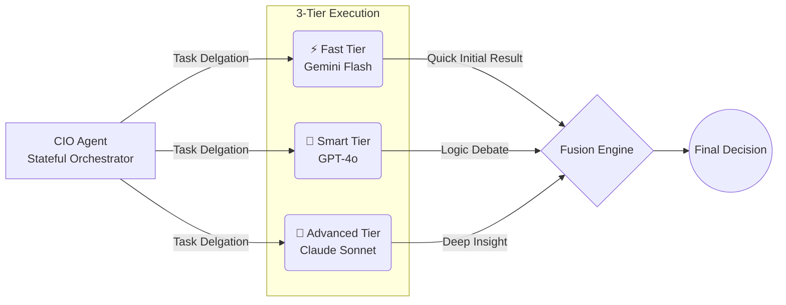

| 2026-02-21 | v5.0 | **Monorepo & Observability**: Formally adopted Microservices Monorepo pattern and integrated OpenTelemetry with SigNoz. | Neo |
| 2026-02-19 | v4.2 | **Postgres-Strict Architecture**: Formalized Three-Tier Data Strategy (Redis/Postgres/Files). Purged all SQLite logic to ensure production reliability (Rule #9). | Neo |
| 2026-02-17 | v4.0.0 | **Hybrid Storage & Security Hardening**: Integrated Rule #11 (Hardened Base) and Rule #12 (Atomic Commit/Wiki Sync). Formalized Hybrid ORM strategy. | Neo |
| 2026-02-15 | v3.6.1 | **Multi-Tier Agent Architecture**: Role × 3-Tier (Advanced/Smart/Fast) 並行模式 | Neo |

<a id="zh"></a>

## 🇹🇼 核心架構哲學 (Core Philosophies)

本專案不僅是一個 AI 投資助理，更是一個展示 **Clean Architecture**、**DDD** 與 **Spec-Driven Design** 整合實踐的技術範本。

### 1. 整潔架構 (Clean Architecture)

> [!IMPORTANT]
> 嚴格遵守依賴規則：**源代碼依賴必須僅指向內部（Domain 層）**。框架與資料庫皆為可插拔的外部細節。

```mermaid
graph TD
    subgraph 外部機制 (External Details)
        UI[UI / Dashboard]
        DB[(PostgreSQL / Redis)]
        API[External APIs]
    end
    
    subgraph 介面適配層 (Adapter Layer)
        Streamlit[dashboard.py]
        Webhook[mcp_service / Webhooks]
        RepoImpl[Data Providers]
    end
    
    subgraph 應用服務層 (Service Layer)
        WF[WorkflowService]
        Sen[SentinelService]
    end
    
    subgraph 領域層 (Domain Layer)
        Entity[Position / Portfolio]
        Interfaces[ILLMGateway / Repositories]
    end

    UI --> Streamlit
    DB -.-> RepoImpl
    API -.-> RepoImpl
    
    Streamlit --> WF
    Webhook --> Sen
    RepoImpl -.-> Interfaces
    
    WF --> Entity
    Sen --> Entity
```

- **領域層 (Domain)**: `src/domain/`。純業務實體（Dataclasses），零外部依賴。
- **應用服務層 (Application)**: `src/services/`。協調領域模型執行 UseCase。
- **基礎設施與適配層 (Infrastructure/Adapters)**: `src/data/` 與 `src/mcp_service/`。實作持久化與 API 橋接。

### 2. 領域驅動設計 (Domain-Driven Design)
我們以「投資領域」為核心進行建模，確保代碼語言與業務專家（PM/投資者）一致。

- **實體 (Entities)**: 如 `Position` 與 `Portfolio`，具備唯一標識與豐富的業務行為（屬性計算）。
- **存儲庫 (Repositories)**: 透過介面隔離持久化細節，讓應用層專注於處理領域對象的集合。
- **貧血模型預防**: 盡可能將邏輯保留在 `entities.py` 的 property 中（如 `unrealized_pnl`），而非全由 Service 計算。

### 3. 規範驅動設計 (Spec-Driven Design)
「文檔即開發」。本專案的 Wiki 不僅是筆記，更是開發的藍圖。

- **迭代流程**: 
    1. 在 Wiki 定義規格與 Sequence Diagram。
    2. 基於規格實作 `interfaces.py`。
    3. 實作業務邏輯並透過 [LLM 回饋循環](提示詞工程規範-Prompt-Engineering-Specs) 進行驗證。
    4. 更新 Wiki 反映實作中的優化點。

### 4. 智能分層與演化 (Intelligence Layering & Multi-Tier Architecture)

> [!NOTE]
> 採用 **Role × Multi-Tier Agents** 並行執行策略，平衡成本、速度與推論深度。



- **編排層 (Orchestrator)**: `CIOAgent` 負責任務拆解與資源調配，具備狀態記憶。
- **執行層 (Sub-agents)**: 並行執行三個級別：
  - 🚀 **Advanced**: 關鍵決策、深度分析 (高成本/高品質)
  - 🧠 **Smart**: 邏輯辯論與日常分析 (中等成本)
  - ⚡ **Fast**: 快速初篩、低風險探索 (極速/低成本)

### 5. 事件驅動演進 (Event-Driven Evolution)
- **主動監控**: 從「被動拉取 (Pull)」轉向「主動推送 (Push)」。`SentinelService` 實作了主動事件監聽，當 VIX 或持倉發生偏移時，主動喚醒慢想系統 (Council)。
- **外部整合**: 透過標準化的 Channel Adapters (參考 [研究與最佳實踐](研究與最佳實踐-Research-Best-Practices)) 整合 Webhook 觸發器。

### 6. 技術選型分析 (Selection Analysis)
- **為什麼選擇 Streamlit？**: 快速迭代 AI 互動介面，減少前端開發成本，專注於 Agent 邏輯。
- **為什麼選擇 PostgreSQL？**: v4.2 全面清除 SQLite 並實施 Postgres 強制政策，利用 `pgvector` 實現全系統統一的語義搜索，並確保資料庫操作具有 ACID 特性。
- **為什麼選擇 Redis？**: 作為 Hot Tier，我們利用 Redis 的極速 Response Caching 顯著降低 OpenRouter/OpenAI API 延遲與成本。
- **為什麼選擇 Hybrid Strategy？**: 針對複雜行情計算與向量搜尋強制使用 Raw SQL (Performance)；針對管理類實體使用 ORM (Efficiency)。

### 7. 資安加固與治理 (Rule #11 & #12)
- **Managed-Security-Base**: 統一使用 `python:3.11-slim-bookworm`，非 root 執行，並嚴格隔離憑證至 `secrets/` 目錄。
- **Atomic-Wiki-Sync**: 堅持原子提交原則，且代碼變更必須同步更新 Wiki。

### 8. 領域微服務庫與可觀測性 (Microservices Monorepo & Observability)
為確保模組不受第三方 I/O 特殊邏輯干擾，採用 **Monorepo** 封裝：
- **邊界隔離**: Dashboard、Notification、MCP Server 與 Scheduler 皆具有獨立的 Dockerfile。
- **單一玻璃窗 (Single Pane of Glass)**: 以 OpenTelemetry 貫穿各模組的通訊，並將 Traces 集中於本地 SigNoz 平台。

---

<a id="en"></a>

## 🇺🇸 Architectural Philosophies

### 1. Clean Architecture
Strict adherence to the **Dependency Rule**: Source code dependencies always point inwards towards the Domain Layer.
- **Independence**: The UI, Database, and Frameworks are treated as pluggable details.

### 2. Domain-Driven Design (DDD)
The domain is the center of our universe.
- **Ubiquitous Language**: Using concepts like "Portfolio", "Rebalance", and "Momentum" across code and docs.
- **Decoupled Persistence**: Repositories provide a collection-like interface to storage.

### 3. Spec-Driven Design
The Wiki serves as the living contract between design and execution.
- **Design-First**: Architectural decisions are documented as ADRs before implementation.

### 4. Proactive Intelligence & Multi-Tier Execution
- **Event-Driven**: Transitioning from a reactive "User Poll" model to a proactive "Sentinel Alert" model.
- **Orchestrator-Multi-Tier Pattern**: Stateful Orchestrator (CIO) coordinates N Sub-Agents, each executing in **3 parallel tiers** (Advanced 🚀 /  Smart 🧠 / Fast ⚡) for optimal cost-quality balance. Fast tier provides quick initial results, Advanced tier adds depth, with voting/fusion mechanisms for final output.

### 5. Microservices Monorepo & Observability
- **Bounded Contexts**: Applications are split into micro-apps `services/dashboard`, `services/scheduler`, etc., sharing logic from `pkg/` or `src/`.
- **Telemetry**: Leveraging OpenTelemetry and SigNoz to ensure total visibility of the Agent Swarm and Event actions.

## 🔗 Bidirectional Links
- **Architect View**: [System Landscape](系統全景圖-System-Landscape)
- **Engineering Handbook**: [Research & Best Practices](研究與最佳實踐-Research-Best-Practices)
- **PM Specs**: [Core System Specs](核心系統規格-Core-System-Specs)
