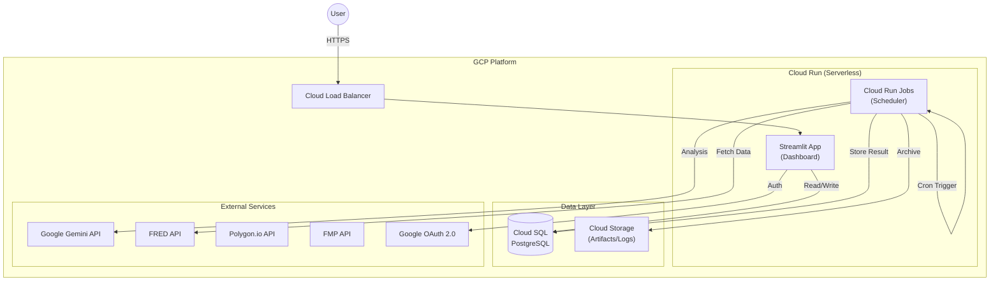

# System Landscape

> **[繁體中文 (Traditional Chinese)](#zh) | [English](#en)**

<a id="zh"></a>

## 🇹🇼 系統架構現狀 (System Architecture)

### 1. 部署現狀 (Deployment Status)
目前的部署狀態為 **Cloud-Ready (雲端就緒)**，但實際生產環境尚未配置 (Provisioned)。

| 組件 | 狀態 | 說明 |
| :--- | :--- | :--- |
| **應用程式 (App)** | ✅ Containerized | Docker Image 建置完成，隨時可部署至 GCP Cloud Run。 |
| **資料庫 (Database)** | ✅ Provisioned | **Cloud SQL (PostgreSQL)** 已建立 (`portfolio-prod`)。程式碼支援透過環境變數切換。 |
| **排程 (Scheduler)** | ✅ Scripts Ready | Shell scripts (`run_daily_check.sh`) 已就緒。GCP Cloud Run Jobs 尚未設定。 |
| **認證 (Auth)** | ✅ OAuth Ready | Google OAuth 已整合，支援雲端與本地回呼。 |
| **歸因引擎 (Refinement)** | ✅ Implementation Ready | 重構完成。已整合至排程器 (Scheduler)。 |
| **Kubernetes** | ✅ Manifests Ready | k8s/ 目錄包含部署設定。支援 Minikube 本地測試。 |

### 2. 現代化雲原生架構圖 (Modern Cloud-Native Architecture)
本系統遵循 **12-Factor App** 原則設計，目標架構如下：



### 3. 下一步 (Next Steps)
若要完成現代化部署，建議執行以下步驟 (需手動或 Terraform)：

1.  **建立 Cloud SQL**:
    ```bash
    gcloud sql instances create portfolio-prod --tier=db-f1-micro --region=asia-east1
    ```
2.  **部署 Cloud Run**:
    ```bash
    gcloud run deploy portfolio-app --image=[IMAGE_URL] --allow-unauthenticated
    ```
3.  **設定環境變數**:
    在 Cloud Run 設定 `DB_TYPE=postgres`, `DB_HOST=[CLOUDSQL_IP]`, `DB_USER=...`。

---

<a id="en"></a>

## 🇺🇸 System Architecture Status

### 1. Deployment Status
**Cloud-Ready**. Application is containerized. Cloud SQL is provisioned.

| Component | Status | Note |
| :--- | :--- | :--- |
| **App** | ✅ Containerized | Docker Image ready. |
| **DB** | ✅ Provisioned | Cloud SQL (PostgreSQL) ready. |
| **Scheduler**| ✅ Scripts Ready | Shell scripts ready. Cloud Run Jobs NOT yet linked. |
| **Auth** | ✅ OAuth Ready | Google OAuth integrated. |
| **Refinement** | ✅ Implementation Ready | Refactoring complete. Integrated with Scheduler. |
| **Kubernetes** | ✅ Manifests Ready | `k8s/` folder contains Deployments/Services. Local support via Minikube. |

### 2. Modern Cloud-Native Architecture
(See Diagram below)
- **Frontend**: Cloud Run Service (Streamlit).
- **Backend**: Cloud Run Jobs (Scheduler).
- **Data**: Cloud SQL + GCS.

### 3. Next Steps
1.  **Create Cloud SQL**: Provision instance.
2.  **Deploy Cloud Run**: Deploy with Env Vars.
3.  **Configure Env**: Set `DB_TYPE=postgres`, `DB_HOST`, etc.
