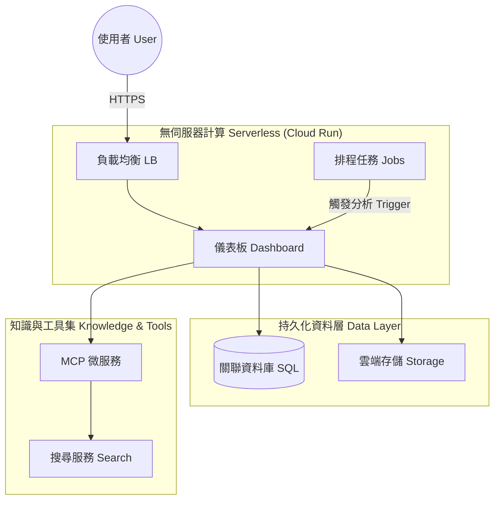

# 系統全景圖 (System Landscape)

> **[繁體中文 (Traditional Chinese)](#zh) | [English](#en)**

## 🇹🇼 系統架構全景圖

本文件提供系統的高層設計概覽，涵蓋組織架構、雲端拓撲與遷移路徑。

### 1. 雙部門架構 (Dual-Unit Architecture)
系統由兩個平行運作的單位組成，確保「決策」與「自我優化」並行：
- **投資顧問部 (Advisory Unit)**: 包含 CIO 與四大專家 Agent，負責市場分析與策略輸出。
- **量化工程部 (Quant Engineering Unit)**: 包含 Engineer Agent，負責觀察績效並自動優化 Prompt 邏輯。

### 2. 雲端原生架構圖 (Cloud-Native Topology)
> [!NOTE]
> 系統遵循 12-Factor App 原則，隨時可部署至 GCP 進行大規模擴展。
> The system follows 12-Factor App principles and is ready for large-scale scaling on GCP.

### 3. 整潔架構檢視 (Clean Architecture Review)

<b>📐 點擊查看架構分層細節 (Click for Architectural Layering Details)</b>

- **實體層 (Entities)**: 定義交易與持倉核心邏輯。
- **案例層 (Use Cases)**: 封裝 Workflow 與 Agent 決策流程。
- **介面層 (Adapters)**: Ingestor (資料攝取) 與 Repository (資料庫存取)。
- **框架層 (Frameworks)**: Streamlit 與 PostgreSQL。

### 4. 遷移路徑 (Migration Path)

<b>🛣️ 點擊查看遷移策略詳解 (Click for Migration Strategy Details)</b>

從 v1 線性流程遷移至 v3 雙部門架構採取 **Side-by-Side (並行)** 策略：
- **第一階段**: 資料層擴充 (日誌與手動輸入)。
- **第二階段**: Agent 雙模化 (Flash/Deep 資源分級)。
- **第三階段**: 流量切換至具備自適應能力的 v3 核心。

---

## 🇺🇸 System Landscape

### 1. Dual-Unit Architecture
- **Advisory Unit**: Market analysis and strategy generation (CIO + Analysts).
- **HR Unit**: Performance monitoring and prompt self-healing (System Engineer).

### 2. Cloud-Native Topology
- **Frontend**: Streamlit on Cloud Run.
- **Backend**: Serverless Batch Jobs for daily/weekly reports.
- **Data**: Cloud SQL (PostgreSQL) and GCS.

### 3. Clean Architecture Review
High commitment to decoupling:
- **Entities**: Core trade and portfolio logic.
- **Use Cases**: Workflow services.
- **Adapters**: Repository patterns for DB isolation.

### 4. Migration Strategy
Incremental **Side-by-Side** transition ensuring zero downtime while upgrading from linear v1 to autonomous v3.

## 🔗 See Also
- [Agent Mesh Protocols](wiki/04_架構觀點-Architect_Views/底層通信協議-Agent-Mesh-Protocols.md)
- [Evolutionary Roadmap](wiki/02_產品經理-Product_Managers/產品演進藍圖-Evolutionary-Roadmap.md)
