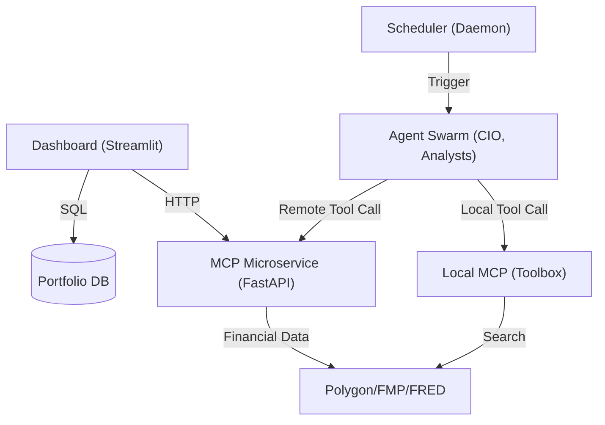
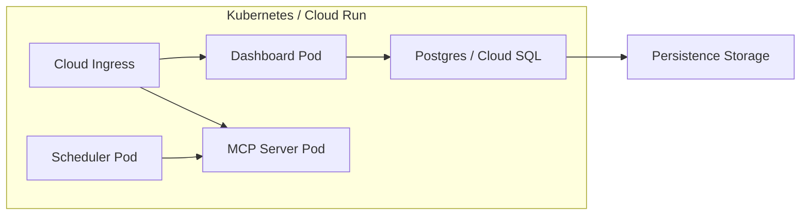

# 系統全景圖 (System Landscape)

> **[繁體中文 (Traditional Chinese)](#zh) | [English](#en)**

---

## 🇹🇼 系統架構全景圖 (Architect View)

本文件依據 [文件框架定義](文件框架定義-Document-Frameworks) 編寫，提供系統的高層設計、組件關係與運作指標。

### 1. 願景與設計目標 (Problem & Goals)
- **挑戰**: AI 系統通常是黑盒且難以大規模管理。
- **目標**: 構建一個高透明度、具備自我監控與自動化對沖能力的「雲端原生」金融代理。
- **架構原則**: 分離推論、計算與持久化，支持 12-factor 無狀態部署。

### 2. C4 架構觀點 (C4 Architecture Model)

#### 2.1 系統上下文 (Level 1: System Context)
系統與外部實體（使用者、數據供應商、AI 基礎設施）的交互。
- **使用者**: 透過 Dashboard 監控資產。
- **外部 API**: Polygon.io (行情/歷史), FMP (基本面/新聞), FRED (總經), Tavily (搜尋), OpenRouter (LLM)。
- **資料持久化**: SQLite (本地/持久磁碟)。

#### 2.2 容器視角 (Level 2: Container Diagram)
內部核心組件及其通訊方式。

#### 2.3 組件互動流 (Interaction Flows)
1.  **數據攝取**: `Dashboard` 接收用戶輸入 -> `DB` 持久化 -> `MCP_Serv` 註冊工具。
2.  **A2A 研究週期**: `Scheduler` 依時區執行 `CIO Agent` -> `CIO` 發動分散式 `Analysts` (A2A Thought Chain) -> 匯總為具備「證據鏈」的報告。
3.  **搜尋擴展**: 若 `Local MCP` 無提供數據，Agent 透過 `mcp_service` 執行分佈式搜尋與數據聚合。

### 3. 基礎設施視角 (Infrastructure View)
系統支援雲端原生部署，透過容器化管理各項服務。

#### 3.1 佈署拓撲 (Deployment Topology)

#### 3.2 關鍵配置文件映射 (Infrastructure Registry)
| 組件 | 配置文件 | 說明 |
| :--- | :--- | :--- |
| **容器鏡像** | [Dockerfile](file:///Users/neohsiung/Work/go/investment-advisor/Dockerfile) | 全系統基礎鏡像與環境。 |
| **MCP 鏡像** | [Dockerfile.mcp](file:///Users/neohsiung/Work/go/investment-advisor/Dockerfile.mcp) | 隔離工具服務的輕量化鏡像。 |
| **K8s 定義** | [k8s/](file:///Users/neohsiung/Work/go/investment-advisor/k8s/) | 包含 Deployment, Service 與 Secret 定義。 |
| **自動化** | [docker-compose.yml](file:///Users/neohsiung/Work/go/investment-advisor/docker-compose.yml) | 本地多服務開發環境。 |

#### 3.3 技術選型與權衡分析 (Selection Analysis & Tradeoffs)
- **FastAPI vs. Flask/Django**: 選擇 FastAPI 是因為其原生支援非同步 (AsyncIO)，對於 Agent Mesh 中的大量異步 API 調用（如新聞抓取、多模型並行推論）具有顯著性能優勢。
- **Streamlit vs. React/Vue**: 雖然 Streamlit 的自定義性較低，但其代碼即 UI 的特性極大縮短了從「模型實驗」到「可視化儀表板」的距離。
- **SQLite vs. Postgres**: 
    - **決定**: 開發環境預設 SQLite (零配置)，生產環境支援 Postgres (高併發)。
    - **權衡**: 放棄了部分 Postgres 特有的 JSONB 優化，以換取極高的環境移植性與開發便捷度。

### 3. 非功能性需求與性能 (NFR & Performance)
- **可擴展性 (Scalability)**:
    - 採用並行處理機制（ThreadPoolExecutor），支援同時對 50+ 標的執行分析。
    - 未來支援 [KubeRay](未來演進規格-Future-Roadmap-Specs) 分散式集群。
- **可靠性 (Reliability)**:
    - **災難復原 (DR)**: 定時備份 `.db` 檔案至雲端存儲 (GCS)。
    - **健康監控**: 透過 [HR 協議](底層通信協議-Agent-Mesh-Protocols) 實現 Agent 狀態監控。
- **性能**:
    - **智慧快取**: Hash-based 快取，命中率目標 > 40% (節省 LLM 成本)。
    - **響應時間**: Dashboard 首屏加載 < 5s；單一專家報告生成 < 15s。

### 4. 成功指標 (Success Metrics)
- **可用性 (Uptime)**: > 99.9%。
- **自我修復率**: 系統偵測到 Zombie Agent 後的自動恢復率需為 100%。

---

## 🇺🇸 System Landscape

### 1. Vision & Design Goals
Building a transparent, cloud-native financial agent suite with 0% hallucination risk through tiered decoupling of reasoning and math.

### 2. C4 Architecture
- **Context**: Interfacing with Polygon, FRED, and OpenRouter.
- **Container**: Streamlit frontend for visualization, MCP for centralized tool management, and Agent Swarm for adaptive decision making.

### 3. NFR & Performance
- **Scalability**: Thread-parallel analysis; KubeRay readiness.
- **Reliability**: Automated GCS backups and HR-based zombie detection.
- **Efficiency**: Hash-based prompt caching to minimize latency and cost.

### 4. Success Metrics
- **Uptime**: > 99.9%.
- **MTTR**: < 5 minutes via automated agent self-healing.

## 🔗 Bidirectional Links
- **Communication Protocols**: [Agent Mesh Protocols](底層通信協議-Agent-Mesh-Protocols)
- **Frontend Architecture**: [View-Service Pattern](前端與服務架構-Frontend-Service-Architecture)
- **Task Planning Engine**: [Task Planning & Execution](任務規劃與執行引擎-Task-Planning-Engine)
- **Memory System**: [Memory & Redis Architecture](記憶系統與Redis架構-Memory-Redis-Architecture)
- **Implementation Status**: [Architecture Status](架構狀態-Architecture-Status)
- **Developer Guide**: [Local Dev Setup](環境設定與本地開發-Environment-Local-Dev)
