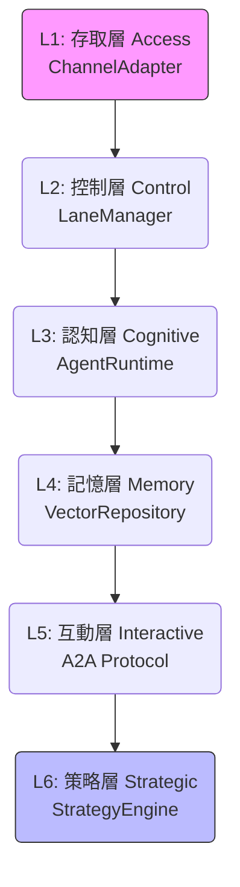
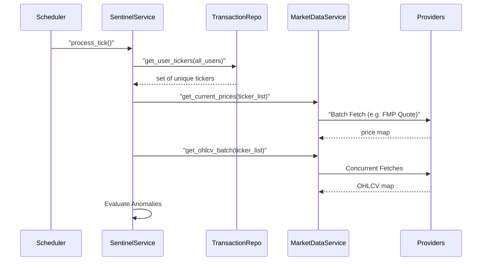

# 系統全景圖 (System Landscape)

> **[繁體中文 (Traditional Chinese)](#zh) | [English](#en)**
> **最新版本 (Latest Version)**: 請參閱文件頂部的版本紀錄 (Iteration Record).

### 版本紀錄 (Version History)
| Date | Version | Description | Author |
| :--- | :--- | :--- | :--- |
| 2026-03-01 | v5.2 | **Tech Stack Modernization**: Removed `futu-api` and upgraded OTel to 1.39.1 / Protobuf 5.x for enhanced security. | Antigravity |
| 2026-02-21 | v5.1 | **Stability & Performance Optimization**: Added Optimized Monitoring Flow (Batch Fetching) and real-time accuracy logic descriptions. | Neo |
| 2026-02-21 | v5.0 | **Microservices Monorepo & Observability**: Integrated SigNoz APM, OpenTelemetry, and Standalone Notification Service into the architecture. | Neo |
| 2026-02-18 | v4.1 | **Async & Multi-Identity Topology**: Refined infrastructure view to reflect non-blocking protocols and UUID resolution. | Neo |
| 2026-02-15 | v3.6 | **Milestone: 75% Coverage** + Leverage Engine & Channel Adapters | Neo |
| 2026-02-14 | v1.2 | Added Multi-Broker + LINE Bot to C4, updated external integrations | Neo |
| 2024-01-04 | v1.0 | Initial Release | Neo |

---

<a id="zh"></a>

## 🇹🇼 系統架構全景圖 (v5.0 Architect View)

本文件依據 [文件框架定義](文件框架定義-Document-Frameworks) 編寫，提供系統的高層設計、組件關係與運作指標。

### 1. 願景與設計目標 (Problem & Goals)
- **挑戰**: AI 系統通常是黑盒且難以大規模管理。
- **目標**: 構建一個高透明度、具備自我監控與自動化對沖能力的「雲端原生」金融代理。
- **架構原則**: 分離推論、計算與持久化，支持 12-factor 無狀態部署。

### 2. C4 架構觀點 (C4 Architecture Model)

#### 2.1 系統上下文 (Level 1: System Context)
系統與外部實體（使用者、數據供應商、AI 基礎設施）的交互。
- **使用者**: 透過 Dashboard 監控資產。
- **外部 API**: Polygon.io (行情), FMP (財報), FRED (總經), Tavily (搜尋), OpenRouter (LLM)。
- **券商 API**: Etoro Bridge, ib_insync (Alpha)。
- **通知**: LINE Messaging API (日報/警報推送)。
- **資料持久化**: PostgreSQL (pgvector) / Redis (快取與記憶系統)。

#### 2.2 容器視角 (Level 2: Container Diagram)
內部核心組件及其通訊方式。

```mermaid
graph TD
    UI[""Dashboard (Streamlit")<br/>services/dashboard"] -->"|SQL| DB[""(PostgreSQL + pgvector")]
    UI -->"|HTTP| MCP_Serv[""MCP Microservice<br/>services/mcp_server"]
    Sch[""Scheduler (Daemon")<br/>services/scheduler"] -->"|Trigger| Agents["""Agent Swarm (Clusters & Council")"]
    Agents -->"|Direct Call| Local["""Local Skills (Registry")"]
    Agents -->|HTTP| MCP_Serv
    MCP_Serv -->"|Financial Data| APIs[Polygon/FMP/FRED/Tavily]"
    Local -->|Search/Compute| APIs

    subgraph "Milestone 5: Trading & Defense"
        ATS[AutomatedTradingService]
        WHS["WebhookService (FastAPI")]
    end

    subgraph "Multi-Broker"
        BF[BrokerFactory] -->"ET[Etoro] & IK[IBKR]"
    end

    Agents -->|Auto-Hedge/Orders| ATS
    ATS -->|Execute| BF
    WHS -->|Trigger| Agents
    
    subgraph "Standalone Notification Microservice"
        NS[""NotificationService (FastAPI")<br/>services/notification"] -->"LNA[LINE Adapter] & MA[Email Adapter] & WA[Web Adapter]"
    end

    Agents -->|HTTP /notify| NS
    Sch -->|HTTP /notify| NS
    LNA -->|Callback| WHS
    WHS -->|HTTP /notify| NS
```

#### 2.3 組件互動流 (Interaction Flows)
1.  **數據攝取**: `Dashboard` 接收用戶輸入 -> `DB` 持久化 -> `MCP_Serv` 註冊工具。
2.  **A2A 研究週期**: `Scheduler` 依時區執行 `CIO Agent` -> `CIO` 發動分散式 `Analysts` (A2A Thought Chain) -> 匯總為具備「證據鏈」的報告。
3.  **混合工具調用**: 
    - **Local Strategy**: Agent 優先調用本地 `Skills` (Registry) 進行快速運算與資料解析。
    - **Scale Strategy**: 若需跨系統資料或全局搜尋，則透過 `mcp_service` 執行。

### 3. 先進智能體作業系統模型 (Six-Layer Agentic OS Model)

系統採用六層垂直抽象架構，確保從用戶指令到資產執行的高可靠度與確定性。



| 層次 (Layer) | 角色 (Role) | 核心組件 (Component) | 邏輯說明 (Logic) |
| :--- | :--- | :--- | :--- |
| **L1: 存取層** | 正規化 I/O | `ChannelAdapter` | **[v5.0 Async]** 將入口 (LINE/Web) 封裝為標準化的 `Event`。整合 `UserRepository` 進行多身分轉 UUID 映射。 |
| **L2: 控制層** | 併發與泳道 | `LaneManager` | 為 session 分配專屬 `Queue`。確保相同用戶指令序列執行。 |
| **L3: 認知層** | 執行環境 | `AgentRuntime` | 動態構建 Prompt (注入Facts)。包含 **Leverage Engine** (0% 幻覺數學運算)。 |
| **L4: 記憶層** | 混合檢索 | `VectorRepository` | 結合 `pgvector` 與 PostgreSQL 全文搜尋實現向量與關鍵字混合搜尋。 |
| **L5: 互動層** | 回饋機制 | `A2A Protcol` | 處理 Agent 間的協作與衝突解決。 |
| **L6: 策略層** | 持久化實施 | `StrategyEngine` | 將最終決策轉化為券商 API 可接受的格式並執行。 |

### 4. 基礎設施視角 (Infrastructure View)
系統支援雲端原生部署，透過容器化管理各項服務。

#### 3.1 佈署拓撲 (Deployment Topology)
- **架構變更 (v5.0)**: 系統已重構為 **Microservices Monorepo (領域微服務單體庫)**。核心業務邏輯移至 `pkg/` 或 `src/` 作為共享庫，而各個可獨立部署的進入點 (Dashboard, Scheduler, Notification, MCP Server) 皆隔離於 `services/` 目錄中。
- **統一遙測 (Unified Telemetry)**: 每個微服務透過 **OpenTelemetry 1.39.1** 發送 Metrics/Traces 至自建的 SigNoz 本地集群。解決了舊版 Protobuf 導致的日誌中斷問題。

```mermaid
graph LR
    subgraph Self-Hosted Infrastructure["Local Docker Compose / Cloud Run"]
        Ing["Traefik / Nginx Ingress"] -->"Dashboard[""services/dashboard"]
        Dashboard -->"DB["""Postgres (pgvector")"]
        Dashboard -->"Redis[""Redis Cache"]
        
        Scheduler["services/scheduler"] -->"|Trigger| Agents[""Core Agents"]
        Scheduler -->"|Notify| Notif[""services/notification"]
        
        MCP_Serv["services/mcp_server"] -->"|Data| APIs[Polygon/FMP]"
        
        Dashboard -.->|OTLP| OTel["OTel Collector"]
        Scheduler -.->|OTLP| OTel
        MCP_Serv -.->|OTLP| OTel
        Notif -.->|OTLP| OTel
    end
    
    subgraph Observability["SigNoz APM Stack"]
        OTel -->"ClickHouse[""(ClickHouse")]
        ClickHouse -->"SigNozUI["""SigNoz Dashboard (Port 8080")"]
    end
    
    DB -->"Storage[""Persistence Storage"]
```

#### 3.2 外部事件與 Webhook 架構 (External Event & Webhook Architecture)
- **架構變更 (v3.5 - v4.0)**: LINE Webhook 與外部警報 (如 TradingView) 改由專屬的 `webhook_service.py` (FastAPI) 獨立處理。
- **原因與考量**:
    - **職責分離 (Separation of Concerns)**: 專注於高併發的事件接收，脫離 MCP 與 Streamlit 的主循環。
    - **全自動防禦 (Auto-Defense)**: `WebhookService` 直接喚醒 `SentinelService` 進行分析，若判定為極端情況，立刻非同步調用 `AutomatedTradingService` 執行清倉與避險。

```mermaid
graph LR
    Ext[""External Alerts (TradingView/LINE")"] -->|"Webhook (POST)"| Ngrok["Ngrok Tunnel"]
    Ngrok -->|"Forward"| WHS[""WebhookService (Port 8000")"]
    WHS -->|"Verify Signature"| Routing["Router Dispatch"]
    Routing -->|"Signal Trigger"| Sentinel["SentinelService"]
    Sentinel -->|"CRITICAL DANGER"| ATS["AutomatedTradingService"]
    ATS -->|"Emergency Liquidation / Hedge"| Broker["BrokerFactory"]
```

#### 3.3 優化市場監控流 (Optimized Monitoring Flow - v1.2.0+)
為了提升擴展性，`SentinelService` 採用了 **Ticker 聚合與批量擷取 (Batch Fetching)** 策略，有效降低 API 負載。



#### 3.4 關鍵配置文件映射 (Infrastructure Registry)
| 組件 | 配置文件 | 說明 |
| :--- | :--- | :--- |
| **容器鏡像** | [Dockerfile](Dockerfile) | 全系統基礎鏡像與環境。 |
| **MCP 鏡像** | [Dockerfile.mcp](Dockerfile.mcp) | 隔離工具服務的輕量化鏡像。 |
| **K8s 定義** | [k8s/]() | 包含 Deployment, Service 與 Secret 定義。 |
| **自動化** | [docker-compose.yml](docker-compose.yml) | 本地多服務開發環境。 |

#### 3.3 技術選型與權衡分析 (Selection Analysis & Tradeoffs)
- **FastAPI vs. Flask/Django**: 選擇 FastAPI 是因為其原生支援非同步 (AsyncIO)，對於 Agent Mesh 中的大量異步 API 調用（如新聞抓取、多模型並行推論）具有顯著性能優勢。
- **Streamlit vs. React/Vue**: 雖然 Streamlit 的自定義性較低，但其代碼即 UI 的特性極大縮短了從「模型實驗」到「可視化儀表板」的距離。
- **PostgreSQL as Primary (v4.0+)**: 
    - **決定**: 全面採用 PostgreSQL 作為核心後端（含本地 Docker 環境），支援 `pgvector` 與 `NUMERIC` 高精度計算。
    - **權衡**: 放棄了 SQLite 的零配置便利，以換取生產環境級別的資料一致性、高併發能力與向量原生檢索。

### 3. 非功能性需求與性能 (NFR & Performance)
- **可擴展性 (Scalability)**:
    - 採用並行處理機制（ThreadPoolExecutor），支援同時對 50+ 標的執行分析。
    - 未來支援 [KubeRay](未來演進規格-Future-Roadmap-Specs) 分散式集群。
- **可靠性 (Reliability)**:
    - **災難復原 (DR)**: 定時備份 `.db` 檔案至雲端存儲 (GCS)。
    - **健康監控**: 透過 [HR 協議](底層通信協議-Agent-Mesh-Protocols) 實現 Agent 狀態監控。
- **性能**:
    - **智慧快取**: Hash-based 快取，命中率目標 > 40% (節省 LLM 成本)。
    - **響應時間**: Dashboard 首屏加載 < 5s；單一專家報告生成 < 15s。

### 4. 成功指標 (Success Metrics)
- **可用性 (Uptime)**: > 99.9%。
- **自我修復率**: 系統偵測到 Zombie Agent 後的自動恢復率需為 100%。

---

<a id="en"></a>

## 🇺🇸 System Landscape

### 1. Vision & Design Goals
Building a transparent, cloud-native financial agent suite with 0% hallucination risk through tiered decoupling of reasoning and math.

### 2. C4 Architecture
- **Context**: Interfacing with Polygon, FRED, and OpenRouter.
- **Container**: Streamlit frontend for visualization, MCP for centralized tool management, and Agent Swarm for adaptive decision making.

### 3. NFR & Performance
- **Scalability**: Thread-parallel analysis; KubeRay readiness.
- **Interface Layer**:
    - **API Gateway**: `mcp_service` (FastAPI) as the central entry point.
    - **Interaction Service**: Handles 2-way communication (Approvals, Commands) via LINE/Slack.
    - **Notification Service**: Handles 1-way alerts (Email, Web Push).
    - **Dashboard**: Streamlit UI for monitoring and manual control.

### 4. Success Metrics
- **Uptime**: > 99.9%.
- **MTTR**: < 5 minutes via automated agent self-healing.

## 🔗 Bidirectional Links
- **Communication Protocols**: [Agent Mesh Protocols](底層通信協議-Agent-Mesh-Protocols)
- **Frontend Architecture**: [View-Service Pattern](前端架構與UX層-Frontend-UX-Layer)
- **Task Planning Engine**: [Task Planning & Execution](任務規劃與執行引擎-Task-Planning-Engine)
- **Memory System**: [Memory & Redis Architecture](記憶系統與Redis架構-Memory-Redis-Architecture)
- **Sentinel & Council**: [Sentinel & Council Architecture](哨兵與評議會架構-Sentinel-Council-Architecture)
- **Developer Guide**: [Local Dev Setup](環境設定與本地開發-Environment-Local-Dev)
