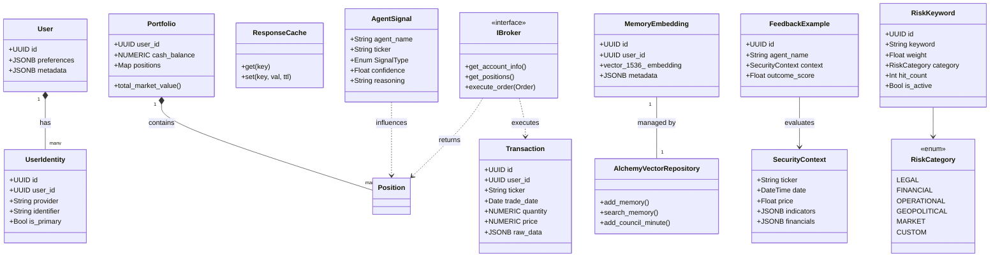
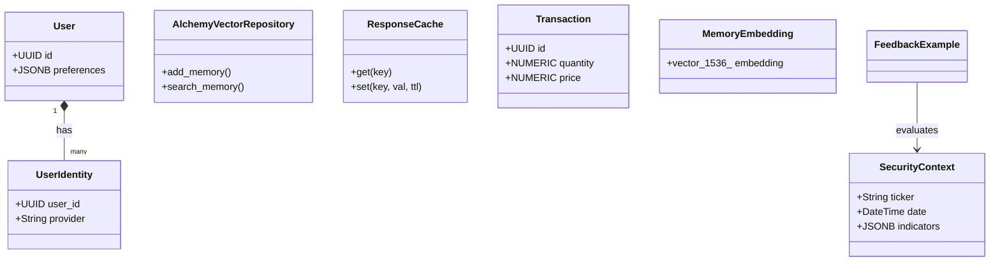

# 資料與領域模型 (Data & Domain Models)

### 版本紀錄 (Version History)
| Date | Version | Description | Author |
| :--- | :--- | :--- | :--- |
| 2026-02-20 | v4.5 | Document audit and history alignment | Neo |

> **[繁體中文 (Traditional Chinese)](#zh) | [English](#en)**

| 2026-02-27 | v4.6 | **NLV & Margin Tracker Fix**: Enforced precise `margin_invested` tracking across `TransactionRepository` and `PnLCalculator`, rectifying phantom cash drift in leveraged trades. | Neo |
| 2026-02-20 | v4.5 | Document audit and history alignment | Neo |
| 2026-02-19 | v4.2 | **Purge SQLite & Three-Tier Architecture**: Removed all SQLite dependencies. Enforced PostgreSQL for persistent storage and Redis for caching. Formalized Three-Tier data strategy. | Neo |
| 2026-02-18 | v4.1 | **UUID Multi-Identity**: Migrated to UUID-based unique identifiers. Added `user_identities` table to support multiple linked logins (Email, LINE, etc.). | Neo |
| 2026-02-17 | v4.0.1 | **Comprehensive Audit**: Added missing domain entities (SecurityContext, Feedback), expanded repository registry, and clarified DB physical types. | Neo |
| 2026-02-14 | v3.5 | Added RiskKeyword entity, risk_keywords table, RiskKeywordRepository | Neo |
| 2024-01-04 | v1.0 | Initial Release | Neo |

---

## 🇹🇼 資料與領域模型 (v4.2)

本文件定義系統的核心實體、資料庫架構與數據流動路徑。v4.2 正式移除 SQLite 支援，全面轉向 **PostgreSQL (Warm Tier)** + **Redis (Hot Tier)** + **CSV/Files (Cold Tier)** 的三層式儲存架構。

### 1. 領域實體關係 (Domain Entity Map)
使用 Pydantic / SQLAlchemy Models 作為領域與持久層的橋樑。

### 2. Domain 檔案結構 (Domain Files)

| 檔案 | 核心實體 | 說明 |
| :--- | :--- | :--- |
| `src/data/models.py` | `User`, `Setting`, `EventLog`, `RiskKeyword` | **[NEW v4.0]** SQLAlchemy ORM 映射實體。 |
| `src/domain/entities.py` | `Portfolio`, `Position`, `AgentSignal`, `SecurityContext`, `FeedbackExample` | 投資組合與 Agent 決策核心實體。 |
| `src/domain/broker.py` | `IBroker` | 多券商介面封裝。 |

### 3. 資料庫架構 (Database Schema v4.2 Full Architecture)

| 表名 | 核心用途 | 關鍵物理設計 (PostgreSQL) |
| :--- | :--- | :--- |
| `users` | 使用者資訊 | `id (TEXT/UUID)`, `preferences (JSONB)`, `last_login (TIMESTAMPTZ)` |
| `user_identities` | 多通路身分映射 | `id (TEXT)`, `user_id (TEXT)`, `provider (TEXT)`, `identifier (TEXT)` |
| `transactions` | 原始交易日誌 | `id (TEXT)`, `quantity (NUMERIC)`, `price (NUMERIC)`, `raw_data (JSONB)` |
| `positions` | 持倉快照 | `user_id (TEXT)`, `avg_cost (NUMERIC)`, `market_value (NUMERIC)` |
| `daily_snapshots` | 績效歷史 | `user_id (TEXT)`, `total_nlv (NUMERIC)`, `leverage_ratio (NUMERIC)` |
| `settings` | 系統設定 | `user_id (TEXT)`, `key (TEXT)`, `value (JSONB)` |
| `memory_embeddings`| RAG 記憶 (pgvector) | `embedding (vector(1536))`, `metadata (JSONB)` |
| `event_logs` | 審核日誌 | `id (TEXT)`, `event_type (TEXT)`, `meta (JSONB)` |
| `risk_keywords` | 風險關鍵字 (Sentinel) | `id (TEXT)`, `weight (NUMERIC)`, `category (TEXT)` |
| `reports` | 歷史分析報告 | `id (TEXT)`, `content (TEXT)`, `summary (TEXT)` |
| `agent_states` | 執行狀態追踪 | `id (TEXT)`, `agent_name (TEXT)`, `last_output (TEXT)` |
| `council_minutes` | 評議路徑錄 | `id (TEXT/UUID)`, `user_id (TEXT)`, `session_id (TEXT)`, `topic (TEXT)`, `participants (TEXT)`, `consensus (TEXT)`, `transcript (TEXT)`, `embedding (vector(1536))` |

### 4. Repository 註冊表 (Repository Registry)

| Repository | 檔案 | 職責 |
| :--- | :--- | :--- |
| `UserRepository` | `user_repository.py` | 身分解析與 UUID 關聯管理 (**SQLAlchemy ORM**) |
| `TransactionRepository` | `transaction_repository.py` | 交易 CRUD (Raw SQL / Performance) |
| `SettingsRepository` | `settings_repository.py` | KV 設定 (**SQLAlchemy ORM**) |
| `HybridMemory` | `memory_manager.py` | 向量嵌入 (pgvector / Raw SQL) |
| `RiskKeywordRepository` | `risk_keyword_repository.py` | 風險關鍵字 (**SQLAlchemy ORM**) |
| `VerificationRepository`| `verification_repository.py` | 驗證碼流程 (**SQLAlchemy ORM**) |
| `FeedbackRepository` | `feedback_repository.py` | Agent 自我學習回饋記錄。 |
| `MarketDataRepository` | `market_data_repository.py` | OHLCV 與市場指標快取。 |
| `SnapshotRepository` | `snapshot_repository.py` | 績效快照序列化。 |
| `AgentStateRepository` | `agent_state_repository.py` | 代理狀態持久化。 |
| `PromptRepository` | `prompt_repository.py` | Prompt 範本版本控制。 |
| `ReportRepository` | `report_repository.py` | 分析報告管理。 |
| `VectorRepository` | `vector_repository.py` | 通用向量操作底層。 |
| `IngestorFactory` | `ingestors/factory.py` | 券商攝取策略註冊表。 |
| `SkillRegistry` | `skills/registry.py` | Agent 本地功能 (Local Skills) 註冊表。 |

### 5. 三層式資料存儲策略 (Three-Tier Data Strategy [NEW v4.2])

為了解決大模型應用的高頻快取與低頻持久化平衡，系統採用以下三層架構：

1.  **🚀 Hot Tier (Redis)**:
    - **用途**: 高頻快取 (`ResponseCache`)、短期會話上下文。
    - **優點**: 極速存取、支援自動過期 (TTL)。
2.  **🧠 Warm Tier (PostgreSQL)**:
    - **用途**: 結構化交易數據、使用者實體、嵌入向量 (`pgvector`)。
    - **優點**: 強大事務、支援複雜 SQL 運算與語義搜尋。
3.  **❄️ Cold Tier (Files/CSV)**:
    - **用途**: 原始 CSV 檔案、離線日誌備份。
    - **優點**: 低成本、作為資料攝取 (Ingestor) 的物理來源。

### 6. 數據流動路徑 (Data Flow)
1. **Ingestion**: CSV/Raw Files → `TradeIngestor` → `transactions` (Warm Tier).
2. **Context Retrieval**: `MemoryManager` → `pgvector` (Warm Tier) → Cache to Redis (Hot Tier) → LLM.
3. **Caching**: LLM Response → `ResponseCache` (Redis) → 重複請求實惠命中。

### 7. ⚖️ 槓桿引擎機制 (Leverage Engine Mechanism - v3.6)
本模組精確計算每筆部位的 **貸款 (Loan)** 與 **淨權益 (Net Equity)**，確保對帳清晰。

- **計算公式 (Formulas)**:
    - **部位市值 (Gross MV)** = 數量 × 現價
    - **部位貸款 (Loan)** = 買入成本 × (槓桿倍數 - 1)
    - **淨權益 (Net Equity)** = 部位市值 - 部位貸款
    - **保證金投入 (Margin Invested)** = 名目價值 / 槓桿倍數 (在 `transactions` 中扣除實質現金)

> [!IMPORTANT]
> 清楚區分 Gross (名目) 與 Net (保證金/權益) 數據，能有效防止在劇烈波動時的保證金誤判。確保 `transaction_repository` 的交易 `amount` 是按照 `(數量 * 買入價) / 槓桿倍數` 扣款，以忠實呈現現金水位的變化。

---

## 🇺🇸 Data & Domain Models (v4.2)

This document defines core entities and DB architecture, establishing the strictly PostgreSQL (Warm Tier) + Redis (Hot Tier) + Files (Cold Tier) backbone. Version 4.2 formally removes all SQLite fallbacks.

### 1. Domain Entity Map (v4.2)
Pydantic and SQLAlchemy models bridge the domain and persistence layers.

### 2. Database Schema (v4.2 Full)
| Table | Core Purpose | PostgreSQL Design |
| :--- | :--- | :--- |
| `users` | User metadata | `UUID`, `JSONB` |
| `user_identities` | Multi-provider Map | `UUID`, `TEXT`, `TEXT` |
| `transactions` | Event Log | `NUMERIC`, `JSONB` |
| `daily_snapshots` | NLV History | `NUMERIC`, `DATE` |
| `memory_embeddings` | Semantic RAG | `vector(1536)` |
| `event_logs` | Audit Trail | `JSONB`, `TIMESTAMPTZ` |
| `risk_keywords` | Risk Keywords | `UUID`, `TEXT`, `NUMERIC` |
| `reports` | Historical Analysis | `UUID`, `TEXT` |
| `agent_states` | Agent Execution State | `TEXT`, `JSONB` |
| `council_minutes` | Council Path Records | `UUID`, `TEXT (user_id)`, `TEXT (session_id)`, `TEXT (topic)`, `TEXT (participants)`, `TEXT (consensus)`, `TEXT (transcript)`, `vector(1536)` |

### 3. Repository Registry
| Repository | Role | Implementation |
| :--- | :--- | :--- |
| `UserRepository` | Identity Resolution | **SQLAlchemy ORM** |
| `TransactionRepository` | Performance-critical CRUD | Raw SQL / Core |
| `SettingsRepository` | KV-based entities | **SQLAlchemy ORM** |
| `HybridMemory` | Semantic retrieval | pgvector / Core |
| `RiskKeywordRepository` | Weighted risk keywords | **SQLAlchemy ORM** |
| `FeedbackRepository` | RLHF/Self-learning context | Domain Repository |
| `MarketDataRepository` | OHLCV & Market Indicators | Cache / API |
| `SnapshotRepository` | Performance Snapshots | Serialization |
| `AgentStateRepository` | Agent State Persistence | Database |
| `PromptRepository` | Prompt Template Versioning | Database |
| `ReportRepository` | Analysis Report Management | Database |
| `IngestorFactory` | Broker-specific Ingestion Strategies| Ingestor Layer |

### 4. Three-Tier Storage Strategy (v4.2)
- **🚀 Hot Tier (Redis)**: High-speed caching (`ResponseCache`) and session state.
- **🧠 Warm Tier (Postgres)**: Persistent structured data, embeddings (`pgvector`), and ACID transactions.
- **❄️ Cold Tier (Files)**: Raw data ingestion sources and offline backups.

### 5. Data Flow
1. **Ingest**: Raw Files → `TradeIngestor` → `transactions` (Warm Tier).
2. **Context**: `MemoryManager` → `pgvector` → `SecurityContext` construction.
3. **Logic**: `Portfolio` entities calculate PnL via `NUMERIC` precision from Postgres.
4. **Cache**: LLM Outputs cached in `ResponseCache` (Redis) for repeated hits.

## 🔗 Bidirectional Links
- **Philosophy**: [Architectural Philosophies](架構哲學-Architectural-Philosophies)
- **DB Standards**: [Database & Git Standards](資料庫設計與代碼規範-Database-Git-Standards)

---

### 6. ⚖️ Leverage Engine Mechanism (v3.6)
Precise calculation of **Loan** and **Net Equity** for each position.
- **Formulas**:
    - **Gross MV** = Qty × Price
    - **Loan** = Cost × (Leverage - 1)
    - **Net Equity** = Gross MV - Loan
    - **Margin Invested** = Nominal Value / Leverage (Calculated directly in `transactions` amount)

> [!IMPORTANT]
> Distinguishing Gross from Net data prevents margin miscalculations during high volatility. Ensure transaction `amount` reflects `(Qty * Price) / Leverage` to maintain an accurate cash balance proxy.
