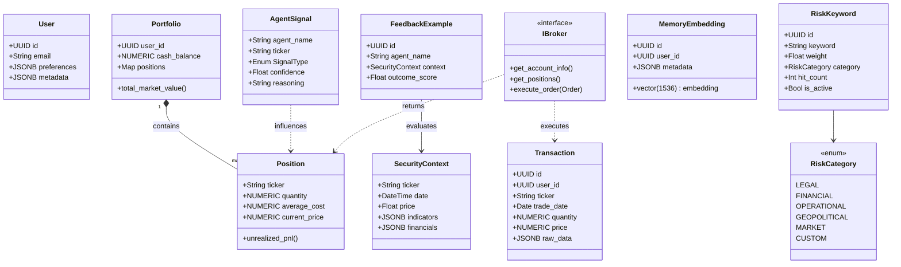
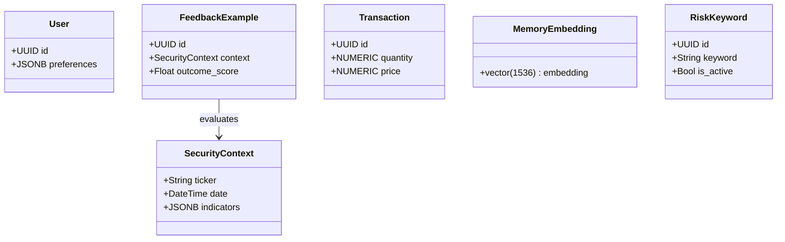

# 資料與領域模型 (Data & Domain Models)

> **[繁體中文 (Traditional Chinese)](#zh) | [English](#en)**

### 版本紀錄 (Version History)
| Date | Version | Description | Author |
| :--- | :--- | :--- | :--- |
| 2026-02-17 | v4.0.1 | **Comprehensive Audit**: Added missing domain entities (SecurityContext, Feedback), expanded repository registry, and clarified DB physical types. | Neo |
| 2026-02-17 | v4.0 | **Unified DB Strategy**: Migrated core entities to PostgreSQL + pgvector. Added Hybrid ORM support. | Neo |
| 2026-02-14 | v3.5 | Added RiskKeyword entity, risk_keywords table, RiskKeywordRepository | Neo |
| 2024-01-04 | v1.0 | Initial Release | Neo |

---

## 🇹🇼 資料與領域模型 (v4.0)

本文件定義系統的核心實體、資料庫架構與數據流動路徑。v4.0 正式由 SQLite 全面遷移至 PostgreSQL + pgvector。

### 1. 領域實體關係 (Domain Entity Map)
使用 Pydantic / SQLAlchemy Models 作為領域與持久層的橋樑。

### 2. Domain 檔案結構 (Domain Files)

| 檔案 | 核心實體 | 說明 |
| :--- | :--- | :--- |
| `src/data/models.py` | `User`, `Setting`, `EventLog`, `RiskKeyword` | **[NEW v4.0]** SQLAlchemy ORM 映射實體。 |
| `src/domain/entities.py` | `Portfolio`, `Position`, `AgentSignal`, `SecurityContext`, `FeedbackExample` | 投資組合與 Agent 決策核心實體。 |
| `src/domain/broker.py` | `IBroker` | 多券商介面封裝。 |

### 3. 資料庫架構 (Database Schema v4.0 Full Architecture)

| 表名 | 核心用途 | 關鍵物理設計 (PostgreSQL) |
| :--- | :--- | :--- |
| `users` | 使用者資訊 | `id (UUID)`, `preferences (JSONB)`, `last_login (TIMESTAMPTZ)` |
| `transactions` | 原始交易日誌 | `id (UUID)`, `quantity (NUMERIC)`, `price (NUMERIC)`, `raw_data (JSONB)` |
| `positions` | 持倉快照 | `user_id (UUID)`, `avg_cost (NUMERIC)`, `market_value (NUMERIC)` |
| `daily_snapshots` | 績效歷史 | `user_id (UUID)`, `total_nlv (NUMERIC)`, `leverage_ratio (NUMERIC)` |
| `settings` | 系統設定 | `user_id (UUID)`, `key (TEXT)`, `value (JSONB)` |
| `memory_embeddings`| RAG 記憶 (pgvector) | `embedding (vector(1536))`, `metadata (JSONB)` |
| `event_logs` | 審核日誌 | `id (UUID)`, `event_type (TEXT)`, `meta (JSONB)` |
| `risk_keywords` | 風險關鍵字 (Sentinel) | `id (UUID)`, `weight (NUMERIC)`, `category (TEXT)` |
| `reports` | 歷史分析報告 | `id (UUID)`, `content (TEXT)`, `summary (TEXT)` |
| `agent_state` | 執行狀態追踪 | `agent_name (TEXT)`, `state (JSONB)` |
| `prompts` | Prompt 範本庫 | `name (TEXT)`, `template (TEXT)`, `version (INT)` |

### 4. Repository 註冊表 (Repository Registry)

| Repository | 檔案 | 職責 |
| :--- | :--- | :--- |
| `TransactionRepository` | `transaction_repository.py` | 交易 CRUD (Raw SQL / Performance) |
| `SettingsRepository` | `settings_repository.py` | KV 設定 (**SQLAlchemy ORM**) |
| `HybridMemory` | `memory_manager.py` | 向量嵌入 (pgvector / Raw SQL) |
| `RiskKeywordRepository` | `risk_keyword_repository.py` | 風險關鍵字 (**SQLAlchemy ORM**) |
| `VerificationRepository`| `verification_repository.py` | 驗證碼流程 (**SQLAlchemy ORM**) |
| `FeedbackRepository` | `feedback_repository.py` | Agent 自我學習回饋記錄。 |
| `MarketDataRepository` | `market_data_repository.py` | OHLCV 與市場指標快取。 |
| `SnapshotRepository` | `snapshot_repository.py` | 績效快照序列化。 |
| `AgentStateRepository` | `agent_state_repository.py` | 代理狀態持久化。 |
| `PromptRepository` | `prompt_repository.py` | Prompt 範本版本控制。 |
| `ReportRepository` | `report_repository.py` | 分析報告管理。 |
| `VectorRepository` | `vector_repository.py` | 通用向量操作底層。 |

### 5. 數據流動路徑 (Data Flow)
1. **Ingestion**: CSV/API → `IngestionService` → `transactions` (Atomic Batch)。
2. **Memory**: `MemoryManager` → `pgvector` 語義檢索 → `SecurityContext` 注入。
3. **Analytics**: 讀取 `NUMERIC` 資料 → `Portfolio` 計算器 → 寫入快照。
4. **Learning**: `Agent` 執行後 → 分析遺漏關鍵字 → 寫入 `FeedbackExample`。

### 6. ⚖️ 槓桿引擎機制 (Leverage Engine Mechanism - v3.6)
本模組精確計算每筆部位的 **貸款 (Loan)** 與 **淨權益 (Net Equity)**，確保對帳清晰。

- **計算公式 (Formulas)**:
    - **部位市值 (Gross MV)** = 數量 × 現價
    - **部位貸款 (Loan)** = 買入成本 × (槓桿倍數 - 1)
    - **淨權益 (Net Equity)** = 部位市值 - 部位貸款

> [!IMPORTANT]
> 清楚區分 Gross 與 Net 數據，能有效防止在劇烈波動時的保證金誤判。

---

## 🇺🇸 Data & Domain Models (v4.0)

This document defines core entities and DB architecture, establishing the PostgreSQL + pgvector backbone.

### 1. Domain Entity Map (v4.0)
Pydantic and SQLAlchemy models bridge the domain and persistence layers.

### 2. Database Schema (v4.0 Full)
| Table | Core Purpose | PostgreSQL Design |
| :--- | :--- | :--- |
| `users` | User metadata | `UUID`, `JSONB` |
| `transactions` | Event Log | `NUMERIC`, `JSONB` |
| `daily_snapshots` | NLV History | `NUMERIC`, `DATE` |
| `memory_embeddings` | Semantic RAG | `vector(1536)` |
| `event_logs` | Audit Trail | `JSONB`, `TIMESTAMPTZ` |
| `risk_keywords` | Risk Keywords | `UUID`, `TEXT`, `NUMERIC` |
| `reports` | Historical Analysis | `UUID`, `TEXT` |
| `agent_state` | Agent Execution State | `TEXT`, `JSONB` |
| `prompts` | Prompt Templates | `TEXT`, `TEXT`, `INT` |

### 3. Repository Registry
| Repository | Role | Implementation |
| :--- | :--- | :--- |
| `TransactionRepository` | Performance-critical CRUD | Raw SQL / Core |
| `SettingsRepository` | KV-based entities | **SQLAlchemy ORM** |
| `HybridMemory` | Semantic retrieval | pgvector / Core |
| `RiskKeywordRepository` | Weighted risk keywords | **SQLAlchemy ORM** |
| `FeedbackRepository` | RLHF/Self-learning context | Domain Repository |
| `MarketDataRepository` | OHLCV & Market Indicators | Cache / API |
| `SnapshotRepository` | Performance Snapshots | Serialization |
| `AgentStateRepository` | Agent State Persistence | Database |
| `PromptRepository` | Prompt Template Versioning | Database |
| `ReportRepository` | Analysis Report Management | Database |

### 4. Hybrid Storage Strategy
- **ORM Admin Layer**: SQLAlchemy ORM for entities (Users, Settings, Logs).
- **Raw SQL Performance Layer**: Raw SQL or Core for performance tracks (Transactions, Memory).

### 5. Data Flow
1. **Ingest**: Raw Data → `transactions` (Batch Insert).
2. **Context**: `MemoryManager` → `pgvector` → `SecurityContext` construction.
3. **Logic**: `Portfolio` entities calculate PnL via `NUMERIC` precision.

## 🔗 Bidirectional Links
- **Philosophy**: [Architectural Philosophies](Architectural-Philosophies)
- **DB Standards**: [Database & Git Standards](Database-Git-Standards)
本模組精確計算每筆部位的 **貸款 (Loan)** 與 **淨權益 (Net Equity)**，確保對帳清晰。

- **計算公式 (Formulas)**:
    - **部位市值 (Gross MV)** = 數量 × 現價
    - **部位貸款 (Loan)** = 買入成本 × (槓桿倍數 - 1)
    - **淨權益 (Net Equity)** = 部位市值 - 部位貸款

- **對帳範例 (Reconciliation Example)**:
    - 假設以 **$X,XXX** 本金開立 **3x** 槓桿部位。
    - **部位市值 (Gross)**: **$Y,YYY**
    - **貸款 (Loan)**: **$Z,ZZZ**
    - **淨權益 (Net Equity)**: **$W,WWW** (與現金合併計算 NLV)

> [!IMPORTANT]
> 清楚區分 Gross 與 Net 數據，能有效防止在劇烈波動時的保證金誤判。
