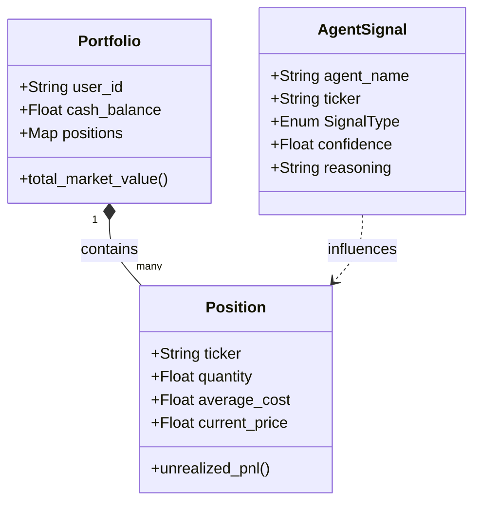

# 資料與領域模型 (Data & Domain Models)

> **[繁體中文 (Traditional Chinese)](#zh) | [English](#en)**

---

## 🇹🇼 資料與領域模型 (Source of Truth)

本文件詳細定義系統的核心實體、資料庫架構與數據流動路徑，確保技術實作與業務邏輯高度一致。

### 1. 領域實體關係 (Domain Entity Map)
我們使用 Pydantic (v1/v2) 或 Dataclasses 作為領域內核，確保數據在進入資料庫前具備強型別校驗。

### 2. 資料庫架構 (Database Schema)
系統採用 [SQLAlchemy](系統全景圖-System-Landscape) 管理多資料庫兼容性。

| 表名 (Table) | 核心用途 (Purpose) | 關鍵字段 (Key Fields) |
| :--- | :--- | :--- |
| `users` | 用戶權限與基本資訊 | `email`, `created_at` |
| `transactions` | 原始交易日誌 | `ticker`, `action`, `quantity`, `price` |
| `positions` | **當前持倉狀態 (Snapshot)** | `quantity`, `avg_cost`, `market_value` |
| `daily_snapshots` | 投資組合績效歷史 | `total_nlv`, `pnl`, `leverage_ratio` |
| `agent_feedback` | **自我學習與反思數據** | `context_embedding`, `outcome_score` |

### 3. 數據流動路徑 (Data Flow)
1. **Ingestion**: 外部 CSV 或 API 資料透過 [Ingestor](環境設定與本地開發-Environment-Local-Dev) 進入 `transactions` 表。
2. **Persistence**: `Repository` 在存儲過程中將 Dict 轉換為 `Domain Entities`。
3. **Analytics**: `Service` 讀取實體集，執行計算（如 `unrealized_pnl`），並將結果寫入 `daily_snapshots`。

---

## 🇺🇸 Data & Domain Models

### 1. The Domain Kernel
We adhere to **DDD (Domain-Driven Design)** principles by centralizing all logic in the Domain Layer (`src/domain/`).
- **Rich Models**: Our entities (`Portfolio`, `Position`) carry business logic properties like `market_value` and `unrealized_pnl`.

### 2. Strategic Schema Design
- **Event Sourcing (Lite)**: `transactions` provide the immutable event log, while `positions` act as the read-optimized projection.
- **Intelligence Loop**: The `agent_feedback` table stores RAG-ready embeddings for automated agent refinement.

## 🔗 Bidirectional Links
- **Philosophy**: [Architectural Philosophies](架構哲學-Architectural-Philosophies)
- **DB Standards**: [Database & Git Standards](資料庫設計與代碼規範-Database-Git-Standards)
- **Service Layer**: [Service Layer Blueprints](服務層開發指南-Service-Layer-Blueprints)
