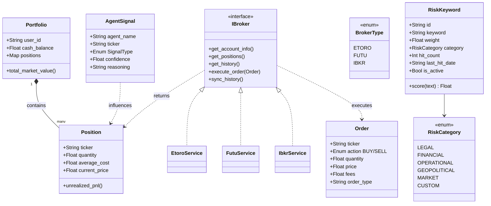

# 資料與領域模型 (Data & Domain Models)

> **[繁體中文 (Traditional Chinese)](#zh) | [English](#en)**

### 版本紀錄 (Version History)
| Date | Version | Description | Author |
| :--- | :--- | :--- | :--- |
| 2026-02-14 | v3.5 | Added RiskKeyword entity, risk_keywords table, RiskKeywordRepository | Neo |
| 2026-02-14 | v3.5 | Added Broker/Trading domain, Repository registry, Memory entities | Neo |
| 2024-01-04 | v1.0 | Initial Release | Neo |

---

## 🇹🇼 資料與領域模型 (v3.5)

本文件定義系統的核心實體、資料庫架構與數據流動路徑，確保技術實作與業務邏輯 (DDD) 高度一致。

### 1. 領域實體關係 (Domain Entity Map)
使用 Pydantic / Dataclasses 作為領域內核，確保強型別校驗。

### 2. Domain 檔案結構 (Domain Files)

| 檔案 | 核心實體 | 說明 |
| :--- | :--- | :--- |
| `src/domain/entities.py` | `Portfolio`, `Position`, `AgentSignal`, **`RiskKeyword`** | 投資組合核心實體 + 風險關鍵字實體。 |
| `src/domain/broker.py` | `IBroker`, `BrokerType`, `Account` | 多券商介面 (Factory Pattern)。 |
| `src/domain/trading.py` | `Order` | 交易指令 (BUY/SELL/Market/Limit)。 |
| `src/domain/interfaces.py` | `IRepository`, `IService` | 基礎介面抽象。 |

### 3. 資料庫架構 (Database Schema)

| 表名 | 核心用途 | 關鍵字段 |
| :--- | :--- | :--- |
| `users` | 用戶權限與基本資訊 | `email`, `created_at` |
| `transactions` | 原始交易日誌 (Event Log) | `ticker`, `action`, `quantity`, `price`, `broker` |
| `positions` | 當前持倉快照 (Snapshot) | `quantity`, `avg_cost`, `market_value` |
| `daily_snapshots` | 投資組合績效歷史 | `total_nlv`, `pnl`, `leverage_ratio` |
| `agent_feedback` | 自我學習與 HR 回饋 | `context_embedding`, `outcome_score` |
| `settings` | 系統設定 (KV Store) | `key`, `value`, `updated_at` |
| `memory` | Agent 記憶 (SQLite Fallback) | `session_id`, `content`, `compressed` |
| **`risk_keywords`** | **風險關鍵字 (Sentinel)** | **`keyword`, `weight`, `category`, `hit_count`, `is_active`** |

### 4. Repository 註冊表 (Repository Registry)

| Repository | 檔案 | 職責 |
| :--- | :--- | :--- |
| `TransactionRepository` | `transaction_repository.py` | 交易 CRUD、Atomic 批次匯入。 |
| `SnapshotRepository` | `snapshot_repository.py` | 績效快照持久化。 |
| `SettingsRepository` | `settings_repository.py` | KV 設定讀寫。 |
| `FeedbackRepository` | `feedback_repository.py` | Agent 互評與回饋。 |
| `MarketDataRepository` | `market_data_repository.py` | OHLCV 快取、行情紀錄。 |
| `MemoryRepository` | `memory_repository.py` | 記憶存取 (SQLite)。 |
| `AgentStateRepository` | `agent_state_repository.py` | Agent 執行狀態。 |
| `PromptRepository` | `prompt_repository.py` | Prompt Template 儲存。 |
| `ReportRepository` | `report_repository.py` | 報告檔案管理。 |
| `DataRepository` | `data_repository.py` | 通用數據存取。 |
| `VectorRepository` | `vector_repository.py` | 向量嵌入 (RAG)。 |
| **`RiskKeywordRepository`** | **`risk_keyword_repository.py`** | **風險關鍵字 CRUD + 命中追蹤 + 復盤分析。** |

### 5. 數據流動路徑 (Data Flow)
1. **Ingestion**: CSV/API → `IngestionService` → `transactions` 表 (Atomic)。
2. **Persistence**: `Repository` 將 Dict → Domain Entity。
3. **Analytics**: `AnalyticsService` 讀取 Entity → 計算 PnL/NLV → 寫入 `daily_snapshots`。
4. **Memory**: `MemoryService` → `MemoryFactory` 選擇 Redis/SQLite 後端。

---

## 🇺🇸 Data & Domain Models (v3.5)

### 1. Domain Kernel
- **DDD**: All logic centralized in `src/domain/`.
- **Rich Models**: `Portfolio`, `Position` carry `unrealized_pnl()`, `market_value()`.
- **Broker Interface**: `IBroker` abstraction via `BrokerType` enum + `Order` entity.

### 2. Schema Design
- **Event Sourcing (Lite)**: `transactions` = immutable log; `positions` = read-optimized projection.
- **Multi-Broker**: `transactions.broker` column tracks origin broker.
- **Memory**: Dual-backend (Redis prod / SQLite local).

### 3. Repository Pattern
12 repositories following `IRepository` contract with parameterized queries (zero SQLi risk).

**Additions in v3.5**: `RiskKeywordRepository` for weighted risk keyword CRUD, hit tracking, and review analytics (stale/top keywords).

## 🔗 Bidirectional Links
- **Philosophy**: [Architectural Philosophies](架構哲學-Architectural-Philosophies)
- **DB Standards**: [Database & Git Standards](資料庫設計與代碼規範-Database-Git-Standards)
- **Service Layer**: [Service Layer Blueprints](服務層開發指南-Service-Layer-Blueprints)
- **Repository Pattern**: [Repository Pattern](設計模式-存儲庫-Repository-Pattern)
