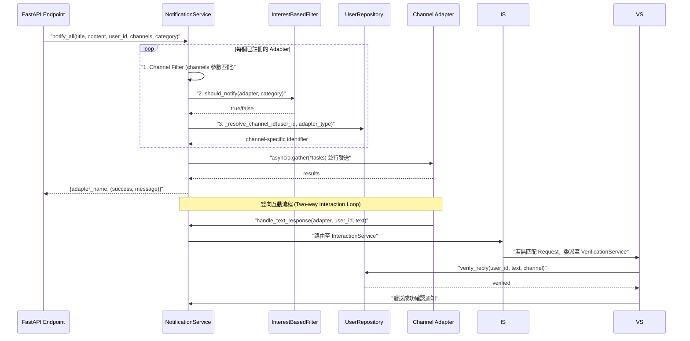

# 通知微服務架構 (Notification Microservice Architecture)

### 版本紀錄 (Version History)

| Date | Version | Description | Author |
| :--- | :--- | :--- | :--- |
| 2026-03-22 | v1.2 | **Formatting Rules**: 新增 LINE 與 Telegram 的 Markdown 預處理邏輯，提升手機端可讀性。 | Antigravity |
| 2026-03-07 | v1.1 | **Verification Loop**: 建立 VerificationService 挑戰應答流程，更新 InteractionService 路由邏輯。 | Antigravity |
| 2026-02-21 | v1.0 | 初版：完整記錄通知微服務架構、API 端點、過濾邏輯與通訊方式 | Antigravity |

---

<a id="zh"></a>

## 🇹🇼 通知微服務概覽

通知系統採用 **Strangler Fig 模式** 從單體應用中抽離，形成獨立的 FastAPI 微服務。它負責將系統產生的警報、報告與審批請求，透過多管道（LINE、Telegram、Email、Slack、Google Chat、Messenger、Web）非同步發送給使用者。

### 架構全景圖

```mermaid
graph TB
    subgraph 主應用 Monolith
        WF[WorkflowService]
        Sent[SentinelService]
        CS[CouncilService]
        Notifier[EmailNotifier<br>src/notifier.py]
    end

    subgraph 通知微服務 Notification Microservice
        API[FastAPI App<br>:"8001]"
        NS[NotificationService]
        NF[InterestBasedFilter]
        CF[ChannelFactory]
        
        subgraph 管道適配器 Channel Adapters
            LINE[LineAdapter]
            TG[TelegramAdapter]
            EMAIL[EmailAdapter]
            SLACK[SlackAdapter]
            GC[GoogleChatAdapter]
            MSG[MessengerAdapter]
            WEB[WebAdapter]
        end
    end

    subgraph 外部服務 External
        LINE_API[LINE Messaging API]
        TG_API[Telegram Bot API]
        SMTP[SMTP Server]
        SLACK_API[Slack API]
        GC_API[Google Chat API]
    end

    WF -->|HTTP POST /api/v1/notify| API
    Sent -->|HTTP POST /api/v1/notify| API
    CS -->|HTTP POST /api/v1/notify| API

    API --> NS
    NS --> NF
    NS --> CF
    CF --> LINE
    CF --> TG
    CF --> EMAIL
    CF --> SLACK
    CF --> GC
    CF --> MSG
    CF --> WEB

    LINE --> LINE_API
    TG --> TG_API
    EMAIL --> SMTP
    SLACK --> SLACK_API
    GC --> GC_API

    Notifier -.->|Legacy 直接發送| SMTP
```

---

## 🏗️ 微服務架構 (Microservice Architecture)

### 1. 獨立服務入口 (`services/notification/`)

| 項目 | 說明 |
| :--- | :--- |
| **入口檔案** | [`services/notification/src/app/main.py`](main.py) |
| **框架** | FastAPI |
| **預設埠** | `8001` |
| **容器化** | [`services/notification/Dockerfile`](Dockerfile) |
| **基礎映像** | `python:3.11-slim-bookworm` |

### 2. 生命週期管理 (Lifespan)

微服務啟動時透過 FastAPI 的 `lifespan` 機制初始化：

```python
@asynccontextmanager
async def lifespan(app: FastAPI):
    # 1. 初始化 OpenTelemetry 與 Logging 追蹤
    # (已移除全域 NotificationService 實例，改為每個 request 在背景任務中獨立解析與發送)
    yield
```

### 3. 可觀測性 (Observability)

- **OpenTelemetry**: 透過 `FastAPIInstrumentor` 自動追蹤所有 HTTP 請求
- **Tracing**: 每個通知處理流程都有獨立的 Span（`process_notification`）
- **Logging**: 使用專案統一的 `setup_logger("NotificationAPI")`

---

## 📡 API 端點 (API Endpoints)

### `GET /health` — 健康檢查

```json
{"status": "ok", "service": "notification_api"}
```

### `POST /api/v1/notify` — 發送通知

**Request Body** (`NotificationRequest`):

| 欄位 | 類型 | 必填 | 預設值 | 說明 |
| :--- | :--- | :--- | :--- | :--- |
| `user_id` | `string` | ✅ | — | 使用者 UUID 或 Email |
| `title` | `string` | ✅ | — | 通知標題 |
| `content` | `string` | ✅ | — | 通知內容 |
| `channels` | `List[str]` | ❌ | `["line", "email"]` | 目標管道 |
| `category` | `string` | ❌ | `"sentinel"` | 通知類別 |
| `actions` | `List[Dict]` | ❌ | `null` | 互動按鈕 |

**Response** (HTTP 202 Accepted):

```json
{"status": "accepted", "message": "Notification queued for delivery."}
```

> 📌 通知處理在 **背景任務 (BackgroundTasks)** 中執行，API 立即回傳 202。

---

## 🔧 核心元件 (Core Components)

### NotificationService — 通知協調器

位於 [`src/services/notification_service.py`](notification_service.py)。

**職責**：

- 協調多管道適配器的並行通知發送
- 身分解析（UUID → 管道特定 ID）
- 管道過濾與興趣匹配

**關鍵流程**：



**身分解析邏輯** (`_resolve_channel_id`):

1. 若 `user_id` 為 `"broadcast"` 或空值 → 直接使用
2. 判斷是否為 UUID 格式
3. 若為 Email → 透過 `UserRepository.get_by_identity("email", ...)` 查詢 UUID
4. 透過 `UserRepository.get_identities(uuid)` 取得所有身分
5. 匹配 `adapter_type` 對應的 `provider` 身分

**工廠方法** (`create_with_settings`):

```python
@staticmethod
def create_with_settings(settings_service, user_id=None):
    adapters = ChannelFactory.create_adapters(settings)
    noti_filter = InterestBasedFilter(settings_service)
    return NotificationService(adapters=adapters, notification_filter=noti_filter)

---

### VerificationService — 驗證服務

位於 [`src/services/verification_service.py`](verification_service.py)。

**職責**：
- 執行「挑戰-應答 (Challenge-Response)」驗證流程。
- 管理驗證碼發送與過期邏輯。
- 支援多管道（LINE、Telegram 等）的身分綁定驗證。

**關鍵方法**：
- `initiate_verification(user_id, channel)`：發送 "OK" 挑戰訊息。
- `verify_reply(user_id, text, channel)`：驗證使用者回覆並更新狀態。
- `verify_any_reply(user_id, text)`：全局自動匹配待處理驗證。
```

---

### InterestBasedFilter — 興趣過濾器

位於 [`src/services/notification_filters.py`](notification_filters.py)。

**過濾邏輯**：

| 條件 | 結果 |
| :--- | :--- |
| `category == "system"` | 永遠發送 |
| 無 `SettingsService` | 永遠發送（Fallback） |
| 使用者設定 `channel_{type}_interests` 包含 `category` | 發送 |
| 否則 | 過濾掉 |

**設定鍵格式**：`channel_{adapter_type}_interests`
**預設值**：`"sentinel,report,approval"`

**範例**：

- `channel_email_interests = "sentinel,report"` → Email 只接收哨兵警報和報告
- `channel_line_interests = "sentinel,approval"` → LINE 接收哨兵警報和審批請求

---

### EmailNotifier — 傳統 Email 發送器

位於 [`src/notifier.py`](notifier.py)。

**職責**：

- 直接透過 SMTP 發送 HTML 格式的投資報告
- 支援 Markdown → HTML 轉換（含專業 CSS 樣式）
- 使用 `aiosmtplib` 非同步發送

**安全機制**：

- 封鎖域名清單（`blocked_domains`）
- 封鎖 Email 清單（`blocked_emails`）
- 支援 TLS (port 465) 和 STARTTLS (port 587)

**配置來源**：

| 參數 | 環境變數 | 預設值 |
| :--- | :--- | :--- |
| SMTP Server | `SMTP_HOST` | `smtp.gmail.com` |
| SMTP Port | `SMTP_PORT` | `587` |
| 寄件者 | `SMTP_USER` | — |
| 密碼 | `SMTP_PASSWORD` | — |
| 收件者 | `EMAIL_RECIPIENT` | — |

---

### 管道適配器預處理 (Channel Adapter Preprocessing)

為了確保在手機端與不同通訊軟體的最佳閱讀體驗，各適配器在發送訊息前會進行針對性的格式轉換：
- **LINE Adapter (`line_adapter.py`)**: 由於 Flex Message 不支援 Markdown，會在發送前剝除 (Strip) 所有粗體 `**`、斜體 `__` 等 Markdown 標記，維持乾淨的純文字與 Emoji。
- **Telegram Adapter (`telegram_adapter.py`)**: 將解析模式設為更穩定的 `HTML`，並將輸入文字中的 `**text**` 轉換為 `<b>text</b>`，避免 Markdown 解析因特殊符號中斷報錯。

---

## 🔌 與主應用的通訊方式

### 通訊模式

| 模式 | 說明 |
| :--- | :--- |
| **HTTP REST** | 主應用透過 `POST /api/v1/notify` 觸發通知 |
| **非同步處理** | 微服務接收後立即回傳 202，背景處理實際發送 |
| **共享資料庫** | 微服務讀取中央 PostgreSQL 的 `settings` 和 `user_identities` 表 |
| **共享程式碼** | 微服務重用 `src/` 下的核心模組（透過 `PYTHONPATH=/workspace`） |

### 部署拓撲

```mermaid
graph LR
    subgraph K8s Cluster
        Main[主應用 Pod<br>:"8501]"
        Notif[通知微服務 Pod<br>:"8001]"
        Sched[排程器 Pod]
    end

    PG["(PostgreSQL")]
    Redis["(Redis")]

    Main -->|HTTP| Notif
    Sched -->|HTTP| Notif
    Main --> PG
    Notif --> PG
    Main --> Redis
```

---

<a id="en"></a>

## 🇺🇸 Notification Microservice Architecture (English)

### Overview

The Notification Microservice is a standalone FastAPI service extracted from the monolith using the **Strangler Fig Pattern**. It handles omni-channel notification delivery (LINE, Telegram, Email, Slack, Google Chat, Messenger, Web) with full OpenTelemetry observability.

### Key Design Decisions

1. **Background Processing**: API returns 202 immediately; actual delivery happens in FastAPI `BackgroundTasks`
2. **Interest-Based Filtering**: Users configure per-channel notification interests via Settings
3. **Identity Resolution**: Automatic mapping from user UUID to channel-specific identifiers via `user_identities` table
4. **Parallel Delivery**: All channel adapters execute concurrently via `asyncio.gather()`
5. **Shared Codebase**: Reuses core `src/` modules to avoid code duplication during migration

### Communication with Monolith

The monolith communicates with the notification microservice via HTTP REST (`POST /api/v1/notify`). The microservice shares the same PostgreSQL database for settings and user identity resolution, following the **Shared Database** pattern appropriate for the current migration phase.

## 🔗 相關文件 (Related Documents)

- **全通路規範**: [[全通路適配器規範-Omni-Channel-Adapter-Standards]]
- **互動頻道設定**: [[互動頻道設定-Channel-Setup]]
- **系統全景圖**: [[系統全景圖-System-Landscape]]
- **可觀測性規範**: [[系統可觀測性與通知規範-Observability-Notification-Standards]]
- **配置管理**: [[配置管理架構-Configuration-Management]]
