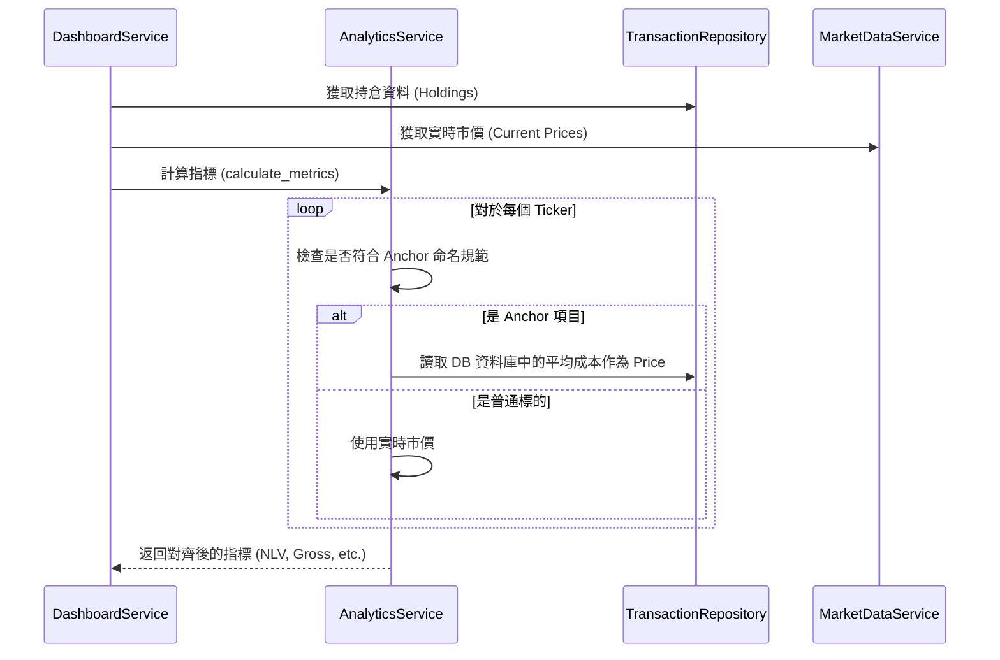

# 數據對齊與校準模式 (Data Alignment and Calibration)

## 概述 (Overview)

在投資顧問系統中，確保儀表板所顯示的指標（NLV, P/L, Cash）與資料庫（Source of Truth）以及券商（eToro）狀態一致是至關重要的。由於歷史數據雜訊、API 延遲或槓桿計算複雜性，系統可能會出現數據飄移。

本文件定義了「靜態錨點」(Static Anchoring) 與「數據校準」(Data Calibration) 的設計模式，用於在此類場景下恢復數據一致性。

## 核心機制 (Core Mechanics)

### 1. 靜態錨點 (Static Anchoring)

為了防止市場波動或 API 故障導致校準後的基準位移，我們對特定標的實施靜態價格解析。

- **命名規範**：凡是以 `__ANCHOR_`、`NLV_` 或 `STABILIZE_` 開頭的代號（Ticker）。
- **處理邏輯**：在 `AnalyticsService` 進行指標計算時，攔截這些代號。不向外部 API 查詢現價，而是直接使用資料庫中的 **平均成本 (Average Cost)** 作為「現價」。
- **優點**：確保校準項目的損益貢獻為零或預期定值，不隨市場波動。

### 2. 數據校準技術 (Calibration Techniques)

當系統計算出的 NLV 與券商 Equity 不符時，使用以下交易類型進行校準：

- **CASH / ETORO_SYNC**：調整可用現金餘額。
- **NLV_ADJUST**：人工補足資產淨值缺口。
- **STABILIZE_CAP / STABILIZE_CASH**：鎖定投入本金或現金基準。

## 架構與實作 (Architecture & Implementation)

## 損益定義標準化 (PnL Standardization)

為了確保用戶體感的一致性，總損益應符合以下公式：

$$Profit (P/L) = NLV - Net Invested Capital$$

- **Net Invested Capital**：定義為 `SUM(Deposits) - SUM(Withdrawals)`，且排除內部校準項（如 `STABILIZE_CAP`）。

## 參考實作 (Reference Implementation)

詳細實作細節請參閱專案 Skill:

- `.agent/skills/portfolio-data-verification/SKILL.md`
