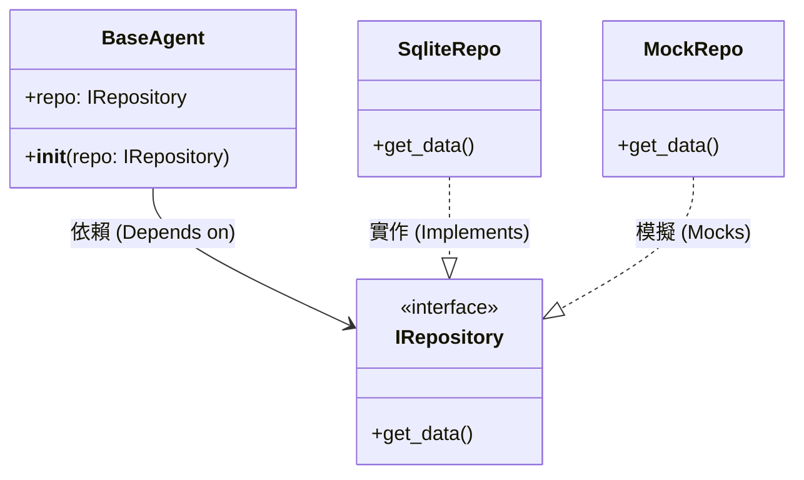

# 依賴注入 (Dependency Injection)

### 版本紀錄 (Version History)
| Date | Version | Description | Author |
| :--- | :--- | :--- | :--- |
| 2026-02-20 | v4.5 | Document audit and history alignment | Neo |


> **[繁體中文 (Traditional Chinese)](#zh) | [English](#en)**

---

<a id="zh"></a>

## 🇹🇼 依賴注入 (IOC Pattern)

本文件依據 [文件框架定義](文件框架定義-Document-Frameworks) 編寫，說明如何透過 IoC 提升 Agent 的可測試性與模組獨立性。

### 1. 願景與設計動機 (Problem & Goals - ADR-004)
- **挑戰**: Agent 內部手動實例化 Repository 導致強耦合，無法在不觸及資料庫的情況下測試分析邏輯。
- **決策**: 全面實施 **建構子注入 (Constructor Injection)**。
- **目標**: 達成 100% 的外部依賴 Mock 化，支持極速單元測試。

### 2. 情境對比 (Good vs. Bad)

````carousel
```python
# ❌ Before: 固定相依 (Hardcoded)
def __init__(self):
    self.repo = SqliteRepo() # 無法在測試時替換
```
<!-- slide -->
```python
# ✅ After: 建構子注入 (詳見 src/agents/base_agent.py)
def __init__(self, repo=None):
    self.repo = repo or SqliteRepo()
```
<!-- slide -->
> [!IMPORTANT]
> **可測試性**: 
> DI 是達成 [高測試覆蓋率](測試與外部服務整合-Testing-External-Services) 的關鍵，它允許我們注入 Mock 物件來模擬 API 失敗等邊際情況。
````

### 3. 非功能性要求 (Testing NFR)
- **測試隔離 (Isolation)**: 核心業務測試嚴禁有任何 I/O 行為。DI 必須保證 Mock 注入的成功。
- **覆蓋率**: 正確使用 DI 後，核心決策模組的測試覆蓋率必須 > 85%，詳見 [測試指南](測試與外部服務整合-Testing-External-Services)。



### 4. 預期效益與成果 (Expected Outcomes)
- **商業價值 (Business Value)**: 完全移除隱性相依，使得開發者在維護與重構策略邏輯時具有極高的安全性與自信心，減少迭代所產生的潛在退化 Bug (Regressions)。
- **性能指標 (Performance Target)**: 透過 I/O 隔離與 Mock 注入，確保 CI/CD 流程中的 100+ 支單元測試能在 3 秒內極速完成運行。

---

<a id="en"></a>

## 🇺🇸 Dependency Injection

### 1. Vision & Goals (ADR-004)
Eliminate hardcoded class dependencies within Agents to enable full testability.

### 2. Good vs. Bad Comparison
- **Bad**: Instantiating a concrete SQLite Repo inside the Agent's `__init__`.
- **Good**: Passing a `repo` instance via the constructor, allowing mock injection during CI cycles.

### 3. Testing NFR
- **Isolation**: Zero I/O during business logic unit tests.
- **Coverage**: Enable >85% logic coverage by mocking expensive LLM/DB components.

### 4. Expected Outcomes
- **Business Value**: Eliminates implicit dependencies, affording developers high confidence when refactoring and directly reducing regression bugs.
- **Performance Target**: Full suite of 100+ unit tests executes within 3 seconds during CI/CD cycles through pure I/O isolation.

## 🔗 Bidirectional Links
- **Handbook Intro**: [Design Patterns Intro](設計模式導讀-Design-Patterns-Intro)
- **Factory Pattern**: [Factory Pattern](設計模式-工廠-Factory-Pattern)
- **Standards**: [Database & Git Standards](資料庫設計與代碼規範-Database-Git-Standards)
