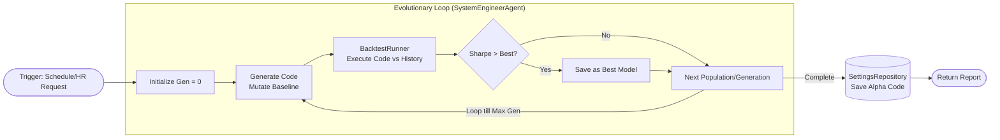

# 智能體集群模式 (Swarm Patterns)

### 版本紀錄 (Version History)
| Date | Version | Description | Author |
| :--- | :--- | :--- | :--- |
| 2026-02-20 | v4.5 | Document audit and history alignment | Neo |

> **[繁體中文 (Traditional Chinese)](#zh) | [English](#en)**

---

## 🇹🇼 智能體集群 (Agentic Coordination)

本文件說明系統如何透過多個 Agent 的協作、並行分析與共識機制，達成高度自動化且精確的投資建議。

### 1. 核心模式：ReAct 迴圈
- **機制**: Think-Act-Observe。
- **實作**: 每個 Agent 在執行時，會根據當前上下文思考是否需要調用工具（Act），並在獲取結果後（Observe）更新認知。

### 2. 評議會共識機制 (Council Swarm)
- **願景**: 避免單一模型的偏見與幻覺。
- **實作**: 透過 `CouncilService` 發動分散式辯論。
    - **Step 1 (Parallel Analysis)**: 多個專家 Agent (Macro, Momentum, Value) 同步執行。
    - **Step 2 (Debate)**: 專家之間互相審核觀點。
    - **Step 3 (Consensus)**: CIO Agent 匯整所有證據鏈，產生最終決策。

### 3. 三階層並發架構 (3-Tier Concurrency Engine - v4.0)
- **願景**: 打破循序執行瓶頸，針對危急訊號提供優雅降級 (Graceful Degradation)。
- **機制**: 透過 `RoleSwarm` 與 `SwarmOrchestrator` 以 `asyncio.gather` 同時啟動三層 Agent。
    - **Fast Tier (⚡ 哨兵/掃描)**: 1~2秒內回傳。若發現 `CRITICAL DANGER` 則立刻 preempt 中止其他層。
    - **Smart Tier (🧠 邏輯/摘要)**: 常規運算，3~4秒回傳。
    - **Advanced Tier (🚀 深度模型)**: 複雜長篇距推論與估值，5+秒回傳。

### 4. 代碼級自主演化 (Alpha-Seeking Genetic Algorithm - v4.0)
- **願景**: 讓顧問具備撰寫量化因子 (Alpha) 程式碼的工程師能力。
- **機制**: 利用 `SystemEngineerAgent` 執行「生成 → 回測 → 篩選」的無限巡迴。

### 5. Map-Reduce 持倉分析
- **情境**: 當用戶擁有大量持倉（例如 50+ 檔美股）時，單次上下文無法容納。
- **模式**:
    - **Map**: 將持倉拆分為多個小組，由多個子 Agent 並行分析。
    - **Reduce**: 匯整各組分析結果，產出整體組合的風險掃描。

### 6. 預期效益與成果 (Expected Outcomes)
- **商業價值 (Business Value)**: Swarm Patterns 將原本的單兵作戰轉化為高智商叢集，透過交叉辯論徹底消除單點的 AI 幻覺，提升決策勝率至專業機構水準。
- **性能指標 (Performance Target)**: 3-Tier 架構的 Graceful Degradation 確保在極端黑天鵝事件下，系統能在 1 秒內優先觸發防禦，並阻斷後續非必要的長文推理，大幅提高生還機率與節省 Tokens。

---

## 🇺🇸 Swarm Patterns

### 1. ReAct Loop
- **Logic**: Think -> Act -> Observe. Each agent explores tools autonomously based on partial information.

### 2. Council Consensus
- **Parallelism**: Multiple specialized agents (Macro, Momentum, etc.) running in parallel to maximize information throughput.
- **Debate Layer**: Cross-agent critique to reduce hallucinations.

### 3. OpenClaw Map-Reduce
- **Scalability**: Chunking large portfolios into smaller groups for parallelized agentic processing, then aggregating results into a final risk report.

### 4. Expected Outcomes
- **Business Value**: Elevates strategy win-rates to institutional levels by utilizing cross-agent debate to entirely eradicate isolated LLM hallucinations.
- **Performance Target**: 3-Tier architecture guarantees a preemptive defense trigger within 1 second during black swan events, gracefully degrading unneeded deep analysis to save tokens and time.

## 🔗 Bidirectional Links
- **Intro**: [Design Patterns Intro](設計模式導讀-Design-Patterns-Intro)
- **Sentinel Architecture**: [Sentinel & Council Architecture](哨兵與評議會架構-Sentinel-Council-Architecture)
- **Swarm Protocol**: [Agent Swarm Protocol](代理人戰略協定-Agent-Swarm-Protocol)
