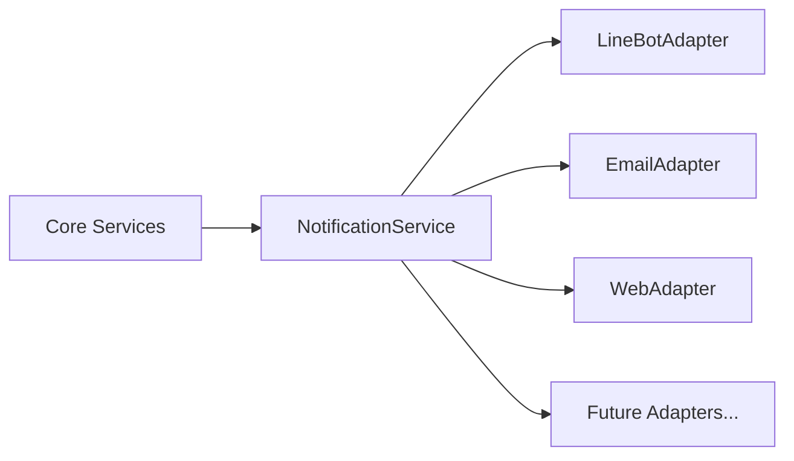

# 全通路適配器規範 (Omni-Channel Adapter Standards)

> **版本**: v4.1 (2026-02-18)
> **狀態**: 已發布 (v4.1 Async & UUID Milestone)

## 1. 設計哲學 (Design Philosophy)
為了解決核心業務邏輯與通訊平台（LINE, Telegram, Email, Web UI）之間的強耦合問題，本系統採用 **適配器模式 (Adapter Pattern)**。

核心目標：
- **穩定內核**: `SentinelService` 與 `WorkflowService` 不應感知具體的 API 格式或協議。
- **熱插拔管道**: 增加新通知渠道只需實作介面，無須改動核心流程。
- **並行發送**: 支援一鍵同步推送至多個渠道。

## 2. 架構核心 (Core Architecture)



### 2.1 介面定義 (`IChannelAdapter`)
所有適配器必須實作 `src.domain.interfaces.IChannelAdapter`：

```python
class IChannelAdapter(ABC):
    @abstractmethod
    async def send_alert(self, user_id: str, title: str, content: str, actions: List[Dict[str, str]] = None, **kwargs) -> bool:
        """非同步發送警報，支援 UUID 身分解析"""
        pass
```

### 2.2 統一協同器 (`NotificationService`)
`NotificationService` 是系統的單一出口，負責：
1. **初始化適配器列表**：加載所有可用的管道。
2. **路由與過濾**：根據 `channels` 參數決定發送範圍。
3. **錯誤隔離**：單一管道故障不影響其他管道。

## 3. 現有管道實作 (Implementations)

| 管道 (Adapter) | 實作細節 | 備註 |
| :--- | :--- | :--- |
| **LINE** | 封裝 `FlexMessage` 格式，支援 `postback` 按鈕。 | 適合即時警報。 |
| **Email** | 封裝 `EmailNotifier`，將 Markdown 轉為 HTML。 | 適合詳細報告。 |
| **Web** | 將訊息寫入 `event_logs` 資料庫表。 | 供 Dashboard 渲染。 |

## 4. 最佳實踐 (Best Practices)

1. **Markdown 優勢**: content 應儘可能使用標準 Markdown，由各適配器自行決定如何降級（例如 LINE 降級為純文字，Web/Email 渲染為 HTML）。
2. **強制非同步並行 (Async Mandatory)**: **[v4.1]** 必須在 `notify_all` 中使用 `asyncio.gather` 進行並行發送，嚴禁使用同步迴圈，以避免單一慢速 API (如 SMTP) 阻塞其它通道。
3. **身分映射解決 (Identity Resolution)**: 核心服務僅傳入 UUID，適配器應配合 `NotificationService` 的 `_resolve_channel_id` 邏輯，將 UUID 轉化為如 LINE User ID 等管道特有標識。
4. **行動指令 (Actions)**: `actions` 應為標籤與數據對，適配器應能轉化為按鈕或連結。

## 5. 擴充指引 (How to Add a Channel)
1. 在 `src/infrastructure/channels/` 建立新的適配器類別。
2. 繼承並實作 `IChannelAdapter`。
3. 在 `ChannelFactory.create_adapters` 中根據配置實例化並加入列表。

---

## 🔗 相關文件 (See Also)
- **[互動頻道設定 (User Guide)](../../01_使用者手冊-User_Manual/互動頻道設定-Channel-Setup.md)**: 終端使用者如何設定各個頻道。
- **[服務層開發指南](../服務層開發指南-Service-Layer-Blueprints.md)**: `InteractionService` 的設計與整合。
- **[測試與外部服務整合](../../03_開發者指南-Developer_Guide/測試與外部服務整合-Testing-External-Services.md)**: 相關測試策略。
