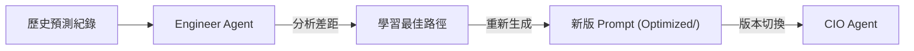

# 提示詞工程規範 (Prompt Engineering Specs)

> **[繁體中文 (Traditional Chinese)](#zh) | [English](#en)**

---

## 🇹🇼 提示詞工程規範 (Intelligence Layer)

本文件詳解 `prompts/` 目錄下的 Intelligence Registry，說明系統如何透過結構化提示詞達成 0% 幻覺的金融分析。

### 1. 提示詞架構 (Prompt Registry)
系統將提示詞視為「外部資源」，透過 `AgentFactory` 進行動態加載。
- **分析師提示詞 (Analyst Prompts)**: 如 `momentum_agent.txt`, `fundamental_agent.txt`。專注於特定維度的數據解讀。
- **決策提示詞 (Decision Prompts)**: `cio_agent.txt`。負責權重分配與最終判斷。
- **元優化器 (Meta-Optimizer)**: `engineer_agent.txt`。用於優化其他 Agent 的 Prompt。

### 2. 資料流與樣板化 (Templating)
提示詞中包含變數預留位（如 `{{market_data}}`），由 `WorkflowService` 在運行時填充。

#### 2.1 自動優化循環 (DSPy Loop)

### 3. 指標與質量 (Prompt NFR)
- **Token 效率**: 核心提示詞長度控制在 2000 Tokens 以內，以維持高速響應。
- **版本管理**: 所有經由 Engineer Agent 優化後的 Prompt 需儲存於 `prompts/optimized/`，並具備 Timestamp 追蹤。

---

## 🇺🇸 Prompt Engineering Specs

### 1. Intelligence Registry
Prompts are treated as first-class assets managed by the `AgentFactory`. 
- **Analyst Tier**: Vertical-specific reasoning (e.g., Sentiment, Macro).
- **Executive Tier**: CIO logic for portfolio weight synthesis.

### 2. Autonomous Optimization
The `Engineer Agent` utilizes a reflection loop to analyze past decision accuracy and dynamically tune LLM signatures using DSPy principles.

### 3. Performance & Tracking
- **Latency**: Minimized through sparse context injection.
- **Traceability**: Optimized prompts are versioned in the `optimized/` subdirectory.

## 🔗 Bidirectional Links
- **Engineering Handbook**: [Design Patterns Intro](設計模式導讀-Design-Patterns-Intro)
- **Agent Mesh**: [Agent Mesh Protocols](底層通信協議-Agent-Mesh-Protocols)
- **PM Specs**: [Core System Specs](核心系統規格-Core-System-Specs)
