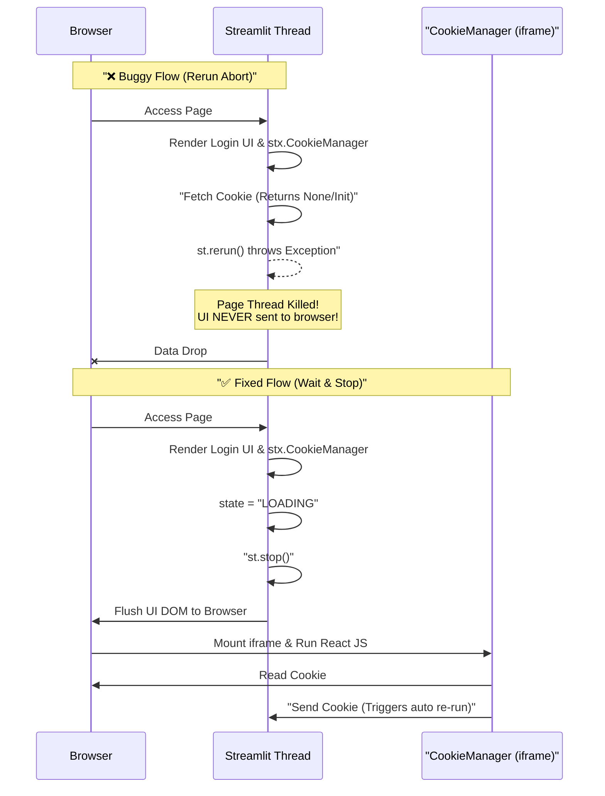

# Streamlit 驗證迴圈故障排除 (Streamlit Auth Loop Postmortem)

### 版本紀錄 (Iteration Record)
| Date | Version | Description | Author |
| :--- | :--- | :--- | :--- |
| 2026-02-20 | v1.0 | Initial Release: Documented Auth State loss and Component Rendering fixes | AI Agent |
| 2026-02-27 | v1.1 | Added Postmortem for OAuth Query Params Race Condition and `st.session_state` Login Loops | AI Agent |

---

## 1. 事故背景 (Background)

在系統開發與維護過程中，發現 Streamlit Google OAuth 登入流程出現嚴重的狀態遺失問題。使用者在登入並點擊「進入系統」後，網頁不會進入 Dashboard，而是閃爍回「請先登入」的狀態；然而，只要切換頁面又會神奇地恢復登入狀態。

During system development and maintenance, a severe state loss issue was discovered in the Streamlit Google OAuth login flow. After users logged in and clicked "Enter System," the webpage would not navigate to the Dashboard but would flash back to the "Please login first" state. Curiously, simply switching pages would magically restore the logged-in state.

## 2. 根本原因分析 (Root Cause Analysis - RCA)

此問題是由 **Streamlit 渲染生命週期 (Render Lifecycle)** 與 **外部 React Component (stx.CookieManager)** 之間的競態條件 (Race Condition) 以及設定錯誤所引起。具體可分為三個致命原因：

This issue was caused by a Race Condition and misconfigurations between the **Streamlit Render Lifecycle** and the **External React Component (stx.CookieManager)**. Specifically, there were three critical failings:

### 2.1. 缺少 Component 綁定金鑰 (Missing Persistent Key)

`stx.CookieManager` 此類額外的 Streamlit Component 在內部是包裝成帶有專屬 ID 的 `iframe` 運行於前端瀏覽器。當原本的宣告沒有給予固定識別碼 `key` 時，只要 Streamlit 因為任何狀態改變 (例如：清除 Query Params) 而重新觸發頁面渲染，該 Component 就會被框架視為「被銷毀並建立了一個全新的 Component」。
**結果**：每次 Rerun 時，負責存取登入證書的 Component 都在不斷重生，導致先前的狀態被洗掉，更使得系統無法在其完成初始化前讀取既有的 Cookie。

External Streamlit components like `stx.CookieManager` are internally wrapped as `iframe` elements with unique IDs running in the front-end browser. When the original declaration lacked a fixed `key` identifier, any state change in Streamlit (e.g., clearing Query Params) that triggered a page re-render would cause the framework to treat the Component as "destroyed and newly created."
**Result**: On every Rerun, the Component responsible for accessing login credentials was constantly respawning. This washed away the previous state and prevented the system from reading the existing Cookie before the component could finish initializing.

### 2.2. 過早的 st.rerun() 中斷渲染週期 (Premature Rerun Aborting UI Flush)

在等待 CookieManager 初始化載入 Cookie 的 Retry 迴圈中，原本調用了 `st.rerun()`。在 Streamlit 架構中，調用 `st.rerun()` 是透過拋出控制流程例外 (RerunException) 來「強制中斷並重啟」當前的 Python 執行緒。**這意味著當前的 UI DOM (包含 Spinner 與最關鍵的 CookieManager Component) 完全不會被送到瀏覽器端渲染！**
**結果**：前端永遠接收不到 Cookie Component，瀏覽器永遠傳不回 Cookie，導致三次 Retry 都失敗並最終退回未登入狀態。只有當最後退回含有「Login」按鈕的畫面並執行 `st.stop()` 時，UI 才會真正 Flush 到前端，這時 Component 才終於掛載並回傳 Cookie。

In the Retry loop waiting for the CookieManager to initialize and load the Cookie, `st.rerun()` was originally called. Under the Streamlit architecture, invoking `st.rerun()` "forcefully aborts and restarts" the current Python thread by throwing a control flow exception (RerunException). **This means that the current UI DOM (including the Spinner and the critical CookieManager Component) is never sent to the browser to be rendered!**
**Result**: The front-end never receives the Cookie Component, and the browser can never send the Cookie back. This leads to all three Retries failing and ultimately falling back to an unauthenticated state. Only when it finally falls back to the screen with the "Login" button and executes `st.stop()` is the UI truly Flushed to the front-end, at which point the Component finally mounts and returns the Cookie.

### 2.3. 控制流例外被誤捕 (Control Flow Exceptions Swept)

在防護 `invalid_grant` 錯誤的廣泛 `except Exception:` 區塊中，未排除 Streamlit 的底層例外 (`RerunData`, `StopException`)。這導致正常的 `st.rerun()` 重新導向行為被誤判為登入失敗，並在介面上噴出令人困惑的紅色錯誤訊息。

In the broad `except Exception:` block meant to protect against `invalid_grant` errors, Streamlit's underlying exceptions (`RerunData`, `StopException`) were not excluded. This caused normal `st.rerun()` redirection behaviors to be misjudged as login failures, spitting out confusing red error messages on the interface.

### 2.4. OAuth Token 驗證與 Query Params 清除的競態條件 (OAuth Token Validation & Query Params Race Condition)

在 Google OAuth 回呼 (Callback) 流程中，當 URL 帶有 `?code=XYZ` 參數時，系統會去換取 Token。原本的邏輯會在換取 Token 後「立刻」將 `st.session_state['connected'] = True`，接著才渲染出「進入系統」按鈕。然而，當使用者點擊按鈕觸發重新渲染 (`st.rerun()`) 時，因為 `connected` 已是 `True`，中介軟體 (Middleware `auth_guard`) 會直接判定為已登入而「完全跳過」背後原本負責清除 `st.query_params.clear()` 的區塊。
**結果**：因為網址列上的 `?code=XYZ` 沒有被清除掉，當後續發生任何全域的重啟 (Rerun) 時，系統又會再次拿已經失效的單次用 `code` 去打 Google API，引發 `invalid_grant` 錯誤，進而觸發錯誤處理機制，把使用者踢回未登入畫面，形成惱人的無限迴圈。

In the Google OAuth Callback flow, when the URL contains the `?code=XYZ` parameter, the system exchanges it for a Token. The original logic would "immediately" set `st.session_state['connected'] = True` right after fetching the Token, and only then render the "Enter System" button. However, when the user clicked the button triggering a re-render (`st.rerun()`), because `connected` was already `True`, the Middleware (`auth_guard`) would directly determine it as authenticated and "completely skip" the block responsible for clearing `st.query_params.clear()`.
**Result**: Because the `?code=XYZ` in the URL bar was never cleared, any subsequent global Rerun would cause the system to reuse the invalidated single-use `code` to hit the Google API again. This triggered an `invalid_grant` error, catching the error handler, kicking the user back to the login screen, and forming a frustrating infinite loop.

---

## 3. 解決方案 (The Fix)

*   **Component 固定化 (Component Anchoring)**: 將 CookieManager 初始化綁定定值：`stx.CookieManager(key="auth_cookie_manager_stable")`。
    Bound the CookieManager initialization to a constant value: `stx.CookieManager(key="auth_cookie_manager_stable")`.
*   **依賴 st.stop() 渲染前端 (Rely on st.stop() to Render Frontend)**: 移除 Retry 迴圈的 `st.rerun()`，改為 `return "LOADING"` 交由外層呼叫 `st.stop()`。利用 `st.stop()` 會在終止時將當前 UI flush 寫入前端的特性，讓 Component 成功掛載，並在前端回傳資料時自動觸發 Streamlit 原生的 Rerun。
    Removed `st.rerun()` from the Retry loop, instead returning `"LOADING"` to let the outer layer call `st.stop()`. Leveraging the fact that `st.stop()` flushes the current UI to the front-end upon termination, this allows the Component to successfully mount and automatically triggers Streamlit's native Rerun when the front-end returns data.
*   **重構 Exception Handler (Refactored Exception Handler)**: 捕捉並忽略 Control Flow Exception。
Caught and ignored Control Flow Exceptions explicitly.
*   **延遲 Session State 更新 (Delayed Session State Update)**: 針對 OAuth Callback，將 `st.session_state['connected'] = True` 的設值時機點「延遲」到使用者確實點擊「進入系統」按鈕之後。這確保了按鈕點擊所觸發的流程必定會走過 `st.query_params.clear()` 清理網址列，隨後才伴隨著正確的登入狀態進入 `st.rerun()`。
    For OAuth Callbacks, "delayed" the assignment of `st.session_state['connected'] = True` until *after* the user definitively clicks the "Enter System" button. This ensures that the flow triggered by the button click absolutely traverses the `st.query_params.clear()` URL cleanup before executing the final `st.rerun()` with the correct authenticated state.

---

## 4. 未來優化待辦事項 (Future Optimization / Action Items)

- [ ] **導入 FastAPI Backend Session API Middleware**: Streamlit 處理第三方 Cookie 本質上過於脆弱（受限於 iframe 沙盒與 Component 掛載延遲）。未來應將 Authentication Token 的發放與驗證移交給原生的 FastAPI `/auth/login` 端點處理，並使用 HTTP-Only Secure Cookie 來守護狀態，再由 Streamlit 單純透過 Header / Cookie 確認即可。
      **Introduce FastAPI Backend Session API Middleware**: Streamlit's handling of 3rd-party cookies is inherently too fragile (limited by iframe sandboxes and component mount delays). In the future, Authentication Token issuance and validation should be handed over to a native FastAPI `/auth/login` endpoint, using HTTP-Only Secure Cookies to safeguard state, while Streamlit simply verifies via Headers/Cookies.
- [ ] **升級 Streamlit 內建 Cookie 功能**: 關注 Streamlit 官方對於原生 Cookie 支援的開發進度 (若有)，以徹底擺脫對 `extra_streamlit_components` 等脆弱的掛載依賴。
      **Upgrade to Streamlit Built-in Cookie Features**: Monitor Streamlit official updates for native Cookie support (if any) to completely eliminate fragile hook dependencies like `extra_streamlit_components`.
- [ ] **實作 OAuth State 安全校驗**: 完善 Google OAuth 流程中的 `state` 參數驗證，防止 CSRF 攻擊，並加入對 Refresh Token 的妥善保管機制（設計 `user_sessions` DB Model）。
      **Implement OAuth State Security Validation**: Perfect the `state` parameter validation in the Google OAuth flow to prevent CSRF attacks, and add proper safekeeping mechanisms for Refresh Tokens (design a `user_sessions` DB Model).
- [ ] **增設 Token 自動續期機制 (Refresh Workflow)**: 若使用者的登入 Session 逾期，可利用自動跳轉機制靜默更新 Token，減少使用者手動重新點擊登入的干擾。
      **Add Token Auto-Renewal Mechanism (Refresh Workflow)**: If a user's login Session expires, utilize automatic redirect mechanisms to silently renew Tokens, minimizing disruptions for users having to manually click login again.

---

## 5. 預期效益與成果 (Expected Outcomes)
- **商業價值 (Business Value)**: 透過剖析這個刁鑽的狀態遺失問題，將痛點沉澱為組織知識，確保後續接手的開發者在設計 Streamlit 第三方組件 (如 `stx.CookieManager`) 時，不再踩中框架渲染流程的無底坑。
- **性能指標 (Performance Target)**: 將原本高達 100% 的前端登入失敗卡死率，徹底修復為 0%。登入體驗回復到直覺、無痕的安全跳轉。
