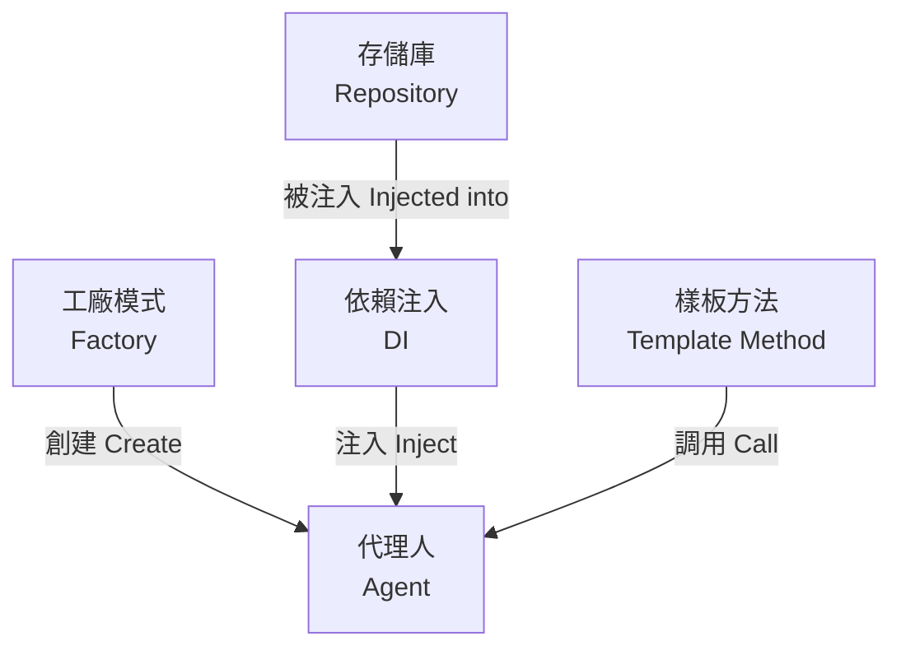

# 設計模式導讀 (Design Patterns Introduction)

> **[繁體中文 (Traditional Chinese)](#zh) | [English](#en)**

## 🇹🇼 設計模式導讀 (Design Patterns Introduction)

> **"Design patterns are solutions to recurring problems; guidelines, not rules."**

本章節旨在幫助開發者理解 AI Investment Advisor v3.1 架構背後的設計決策。我們不僅僅是為了套用模式而套用，而是為了解決具體的工程挑戰：**測試難度 (Testability)**、**耦合度 (Coupling)** 與 **擴展性 (Extensibility)**。

## 🎯 學習目標 (Learning Objectives)

閱讀本系列文檔後，你將能夠：
1.  理解為什麼我們選擇 Factory Pattern 來管理 Agent 創建。
2.  學會如何使用 Repository Pattern 將資料庫操作與業務邏輯分離。
3.  掌握 Dependency Injection (DI) 在系統測試中的關鍵角色。
4.  識別 Template Method 如何簡化日常與週報的工作流。

### 🧩 模式關聯圖 (Inter-Pattern Relationship)
> [!NOTE]
> 此圖展示了不同設計模式如何協作，共同構建出高內聚、低耦合的系統。
> This diagram shows how different design patterns collaborate to build a high-cohesion, low-coupling system.

## 📚 章節索引 (Table of Contents)

1.  **[工廠模式 (Factory Pattern)](Patterns/Factory-Pattern.md)**
    *   *解決問題*: Agent 初始化複雜，依賴眾多。
    *   *應用場景*: `AgentFactory` 統一創建 Momentum, Macro, CIO Agent。

2.  **[存儲庫模式 (Repository Pattern)](Patterns/Repository-Pattern.md)**
    *   *解決問題*: SQL 散落在業務邏輯中，難以更換 DB 或 Mock。
    *   *應用場景*: `SettingsRepository`, `TransactionRepository`。

3.  **[依賴注入 (Dependency Injection)](Patterns/DI-Pattern.md)**
    *   *解決問題*: 高層模組 (Agent) 依賴低層實作 (Sqlite)，導致無法單元測試。
    *   *應用場景*: Agent 建構子注入 Repository。

4.  **[樣板方法 (Template Method)](Patterns/Template-Method.md)**
    *   *解決問題*: DailyWorkflow 與 WeeklyWorkflow 流程高度重複。
    *   *應用場景*: `BaseWorkflow.run()` 定義骨架。

## 🤖 Agentic Patterns (New in v3.1)

<b>🧠 點擊查看 Agent 專屬模式 (Click to View Agentic Patterns)</b>

隨著系統進化為 Agent Swarm，我們也引入了 Agent 專屬的設計模式：

1.  **ReAct (Reason + Act)**
    *   *定義*: 結合推理 (Thinking) 與行動 (Function Calling) 的循環。
    *   *應用*: 本系統的 Agent 在決策前會先搜索新聞 (Act)，再進行分析 (Reason)。

2.  **Reflection (Self-Correction)**
    *   *定義*: Agent 產出結果後，由另一個角色 (或自身) 進行批判與改進。
    *   *應用*: `RefinementEngine` 負責檢視 Agent 歷史表現並調整 Prompt。

3.  **Collaborative Swarm**
    *   *定義*: 多個角色 (Persona) 共同解決問題，而非單一大模型。
    *   *應用*: CIO Agent 整合 Momentum, Fundamental, Sentiment Agents 的異質觀點。

## 🚀 如何學習 (How to Learn)

建議依照以下步驟進行學習：
1.  **閱讀問題 (Challenge)**: 先看該模式試圖解決什麼痛點。
2.  **檢視前後對比 (Before/After)**: 比較重構前與重構後的程式碼差異。
3.  **實作練習**: 嘗試在新增功能時套用這些模式 (例如新增一個 `SentimentRepository`)。

---

## 🇺🇸 Design Patterns Introduction

> **"Design patterns are solutions to recurring problems; guidelines, not rules."**

This section aims to help developers understand the design decisions behind the AI Investment Advisor v3.1 architecture. We adopt patterns not just for the sake of it, but to solve specific engineering challenges: **Testability**, **Coupling**, and **Extensibility**.

## 🎯 Learning Objectives

After reading this series, you will be able to:
1.  Understand why we chose the **Factory Pattern** for Agent creation.
2.  Learn how to use the **Repository Pattern** to decouple database operations from business logic.
3.  Master the role of **Dependency Injection (DI)** in system testing.
4.  Identify how the **Template Method** simplifies daily and weekly workflows.

## 📚 Table of Contents

1.  **[Factory Pattern](Patterns/Factory-Pattern.md)**
    *   *Problem*: Complex Agent initialization with many dependencies.
    *   *Use Case*: `AgentFactory` centralizes creation of Momentum, Macro, and CIO Agents.

2.  **[Repository Pattern](Patterns/Repository-Pattern.md)**
    *   *Problem*: SQL scattered across business logic, making it hard to switch DBs or Mock.
    *   *Use Case*: `SettingsRepository`, `TransactionRepository`.

3.  **[Dependency Injection](Patterns/DI-Pattern.md)**
    *   *Problem*: High-level modules (Agents) depending on low-level implementations (SQLite), preventing unit testing.
    *   *Use Case*: Injecting Repositories via Agent constructors.

4.  **[Template Method](Patterns/Template-Method.md)**
    *   *Problem*: High duplication between DailyWorkflow and WeeklyWorkflow.
    *   *Use Case*: `BaseWorkflow.run()` defines the skeleton.

## 🤖 Agentic Patterns (New in v3.1)

As the system evolves into an Agent Swarm, we adopt specific patterns for AI Agents:

1.  **ReAct (Reason + Act)**
    *   *Definition*: Interleaving reasoning traces with action execution.
    *   *Application*: Agents search news (Act) before analyzing (Reason).

2.  **Reflection (Self-Correction)**
    *   *Definition*: Critiquing and refining outputs iteratively.
    *   *Application*: `RefinementEngine` reviews past predictions to optimize Prompts.

3.  **Collaborative Swarm**
    *   *Definition*: Multiple specialized personas working together.
    *   *Application*: CIO Agent synthesizes diverse views from Momentum, Fundamental, and Sentiment Agents.

## 🚀 How to Learn

1.  **Read the Challenge**: Understand what pain point the pattern solves.
2.  **Compare Before/After**: Review the code changes from refactoring.
3.  **Practice**: Try applying these patterns when adding new features (e.g., adding a `SentimentRepository`).

*Next: [Deep Dive into Factory Pattern](Patterns/Factory-Pattern.md)*
