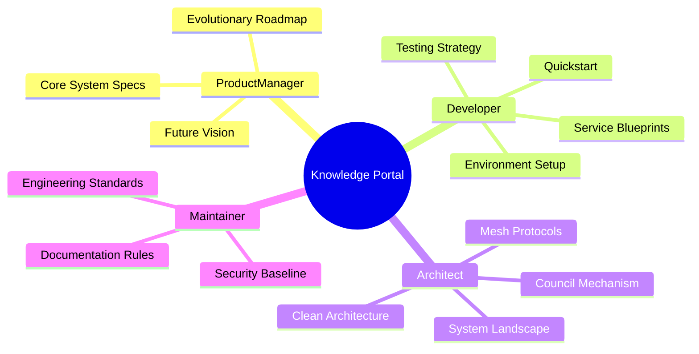

# AI Investment Advisor Wiki 🚀

### 版本紀錄 (Version History)
| Date | Version | Description | Author |
| :--- | :--- | :--- | :--- |
| 2026-03-13 | v5.6 | **Universal Prioritization Upgrade**: Integrated `SentinelAgent` for all-source event prioritization, introduced `[CONVINCING_ACTION]` structured decision triggers, and synchronized cross-wiki architecture blueprints. | Antigravity |
| 2026-02-21 | v5.1 | **Stability & Accuracy Release (v1.2.0+)**: Refactored test suite to native `pytest-asyncio`, optimized Sentinel monitoring via batch fetching, and implemented real-time accuracy analytics based on `price_at_signal`. | Neo |
| 2026-02-21 | v5.0 | **Microservices Monorepo & Observability**: Integrated SigNoz APM, OpenTelemetry, and Standalone Notification Service into the architecture. | Neo |
| 2026-02-20 | v4.2 | **Production Standardization**: Standardized all internal links and file structures for Production v1.0.0 release. | Neo |
| 2026-02-18 | v4.1 | **Architectural Sync**: Enhanced persona-based navigation and Mermaid diagrams. | Neo |

歡迎來到 AI Investment Advisor 的專業知識門戶。本專案不僅是一個投資系統，更是高度工程化、規範驅動 (Rule-driven) 的智能體協作平台。

Welcome to the AI Investment Advisor knowledge portal—a high-stakes agent swarm platform built on rigorous engineering and governance.

---

## 🧭 按角色導引 (Knowledge by Persona)

無論你是決定產品領域的 PM、編寫代碼的開發者、還是規劃系統的架構師，請選擇對應的「降落傘 (Parachute)」進入深度文檔。這份指引將幫助你迅速掌握專案輪廓：

### 👑 產品經理 (Product Manager - Vision)
*聚焦於商業價值、產品演進軌跡與核心業務邏輯的定義，目標是最大化 Alpha 產出與風險防禦。*
- **[產品演進藍圖](產品演進藍圖-Evolutionary-Roadmap)**: 了解專案從 v1 工具型應用，演化至 v4.0 Agent Swarm Economy 的戰略發展史。
- **[核心系統規格 (v5.4.0)](哨兵與評議會架構-Sentinel-Council-Architecture)**: 深入了解「全域優先級判定 (Universal Prioritization)」與「評議會辯論 (Council)」的具體產品機制與自動化交易觸發條件。
- **[未來演進規格 (v4.0)](未來演進規格-Future-Roadmap-Specs)**: 探索下一階段「智慧管家」與「全通路 (Omni-channel)」落地的藍圖。

### 🛠️ 開發者 (Developer - Execution)
*聚焦於快速上手開發、API 整合實踐、以及如何在測試覆蓋率 > 75% 的標準下貢獻代碼。*
- **[快速啟動與操作指南](快速啟動與操作指南-Quickstart-User-Guide)**: 如何在 5 分鐘內建置環境並透過 Docker Compose 啟動全端點。
- **[環境設定與本地開發](環境設定與本地開發-Environment-Local-Dev)**: 掌握 Python Async I/O 除錯技巧與本地端 VS Code 配置。
- **[服務層開發指南](服務層開發指南-Service-Layer-Blueprints)**: 學習系統特有的 Service / Repository 模式，以及如何註冊一個新的 Agent 到 Swarm 體系。
- **[測試與外部服務整合](測試與外部服務整合-Testing-External-Services)**: 了解如何模擬 (Mock) LLM 回應以撰寫可靠的單元測試，達成 100% 錯誤路徑覆蓋。

### 📐 架構師 (Architect - Blueprints)
*聚焦於高併發系統設計、微服務邊界劃分、以及為何選擇如此混搭 (PostgreSQL + Redis + pgvector) 的數據庫拓樸。*
- **[系統全景圖](系統全景圖-System-Landscape)**: 系統 C4 模型拓樸，展示 Webhook 觸發、Agent 喚醒與券商下單的全局數據流向。
- **[架構哲學](架構哲學-Architectural-Philosophies)**: 探討 Clean Architecture 與 Domain-Driven Design (DDD) 在本專案中的落地權衡與決策 (ADR)。
- **[底層通信協議](底層通信協議-Agent-Mesh-Protocols)**: 詳解 Model Context Protocol (MCP) 與 Swarm 內部 Tool Calling 的通訊標準。
- **[哨兵與評議會架構](哨兵與評議會架構-Sentinel-Council-Architecture)**: 剖析 Fast/Smart/Advanced 3-Tier 降級引擎與碎形辯論機制的底層實作。

### 🛡️ 維護者 (Maintainer - Governance)
*確保所有程式碼提交與知識累積符合最高標準，負責資安基線、依賴項審計與效能監控。*
- **[文件規範 (Wiki Standard)](文件規範-Wiki-Standard)**: 維護專案知識的「單一真理點」，確保連結扁平化與雙語雙軌並行的高一致性。
- **[系統可觀測性與通知規範](系統可觀測性與通知規範-Observability-Notification-Standards)**: 定義 OTel 打點、SigNoz 集中監控以及通知服務非同步化的標準。
- **[資料庫設計與代碼規範](資料庫設計與代碼規範-Database-Git-Standards)**: 嚴格執行 Schema Migration 審查、原子化 Commit (Atomic Commits) 紀律。
- **[資安管理與基礎映像檔規範](資安管理與基礎映像檔規範-Security-and-Base-Image-Standard)**: 從 Docker Hardened Image 選型到 .env 密鑰隔離的最高指導方針。

---

## 📊 專案指標 (Project Vitals)

- **架構模式**: Clean Architecture + Domain-Driven Design (DDD)
- **AI 策略**: 3-Tier Tiered Routing (Advanced / Smart / Fast)
- **數據策略**: Hybrid Strategy (Redis / Postgres / pgvector)
- **交付目標**: 100% Dockerized, > 75% Test Coverage

---
*欲瀏覽完整文件清單，請使用左側導引列 (Sidebar)。如有需要查看歷史文檔，請參閱 [封存-Archive](封存-Archive)。*
