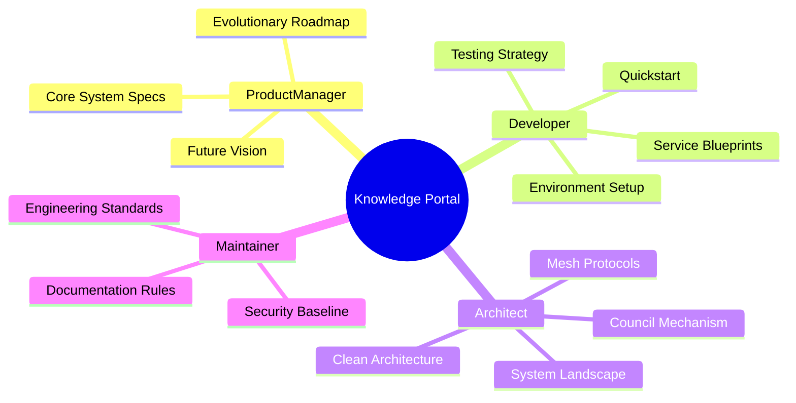

# AI Investment Advisor Wiki 🚀

歡迎來到 AI Investment Advisor 的專業知識門戶。本專案不僅是一個投資系統，更是高度工程化、規範驅動 (Rule-driven) 的智能體協作平台。

Welcome to the AI Investment Advisor knowledge portal—a high-stakes agent swarm platform built on rigorous engineering and governance.

---

## 🧭 按角色導引 (Knowledge by Persona)

無論你是決定產品方向、編寫代碼、還是優化架構，請從下方入口進入對應深度文檔：

### 👑 產品經理 (Product Manager - Vision)
*聚焦於產品演進、核心價值與業務邏輯。*
- **[產品演進藍圖](產品演進藍圖-Evolutionary-Roadmap)**: 從 v1 到 v4.0 的戰略規劃。
- **[核心系統規格 (v3.8)](核心系統規格-Core-System-Specs)**: 哨兵與評議會的決策機制細節。
- **[未來演進規格 (v4.0)](未來演進規格-Future-Roadmap-Specs)**: 邁向 Agent Swarm Economy 的下一站。

### 🛠️ 開發者 (Developer - Execution)
*聚焦於快速上手、API 整合與測試覆蓋。*
- **[快速啟動與操作指南](快速啟動與操作指南-Quickstart-User-Guide)**: 環境建置與一鍵啟動。
- **[環境設定與本地開發](環境設定與本地開發-Environment-Local-Dev)**: Python Async I/O 與 VS Code 調試。
- **[服務層開發指南](服務層開發指南-Service-Layer-Blueprints)**: 如何新增一個 Service 或自定義 Agent。
- **[測試與外部服務整合](測試與外部服務整合-Testing-External-Services)**: 100% 錯誤路徑覆蓋策略。

### 📐 架構師 (Architect - Blueprints)
*聚焦於系統全景、通信協議與清潔架構。*
- **[系統全景圖](系統全景圖-System-Landscape)**: 混合雲拓撲與數據流向。
- **[架構哲學](架構哲學-Architectural-Philosophies)**: 為什麼我們選擇 Clean Architecture & DDD。
- **[底層通信協議](底層通信協議-Agent-Mesh-Protocols)**: MCP 協議與 Tool Calling 的深入解析。
- **[哨兵與評議會架構](哨兵與評議會架構-Sentinel-Council-Architecture)**: 碎形辯論機制的底層設計。

### 🛡️ 維護者 (Maintainer - Governance)
*聚焦於標準執行、資安審計與性能監控。*
- **[文件規範 (Wiki Standard)](文件規範-Wiki-Standard)**: 確保知識庫的可讀性與一致性。
- **[資料庫設計與代碼規範](資料庫設計與代碼規範-Database-Git-Standards)**: Schema 異動與 Commit 嚴謹度。
- **[資安管理與基礎映像檔規範](資安管理與基礎映像檔規範-Security-and-Base-Image-Standard)**: 安全基線與祕鑰管理。

---

## 📊 專案指標 (Project Vitals)

- **架構模式**: Clean Architecture + Domain-Driven Design (DDD)
- **AI 策略**: 3-Tier Tiered Routing (Advanced / Smart / Fast)
- **數據策略**: Hybrid Strategy (Redis / Postgres / pgvector)
- **交付目標**: 100% Dockerized, > 75% Test Coverage

---
*欲瀏覽完整文件清單，請使用左側導引列 (Sidebar)。*
