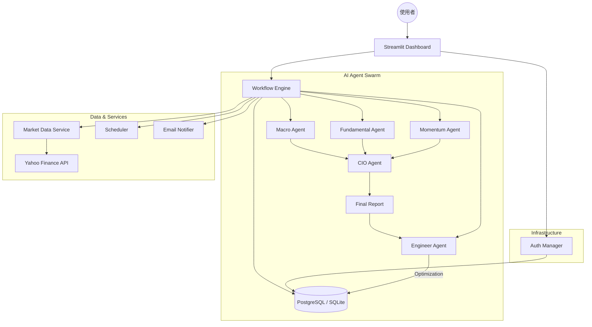

# 系統概觀 (System Overview)

> 返回 [[Home]] | 相關: [[AI-Agent-Swarm]]

## 目標 (Goal)
構建一個智慧化、自動化且具備高度擴展性的 AI 投資顧問平台，協助使用者在複雜的市場中做出理性的投資決策。

## 為什麼 (Why)
- **克服人性弱點**: 投資人常受情緒影響 (FUMO, Panic Sell)，AI 提供客觀數據分析。
- **資訊爆炸**: 市場資訊過多，單憑人力難以消化，需要 AI 進行摘要與洞察。
- **普惠金融**: 將專業的投資顧問服務 (CIO Level) 以低成本提供給一般投資者。

## 做了什麼 (What)
本系統主要由三個核心層級組成：

1.  **使用者介面層 (UI Layer)**: 基於 Streamlit 的互動式儀表板。
2.  **AI 核心層 (AI Core)**: 多代理人協作系統 (Agent Swarm)。
3.  **基礎設施層 (Infrastructure)**: 支援 Local/Cloud 雙模部署的數據與運算環境。

## 如何進行 (How)

### 1. 系統架構圖 (Architecture Diagram)

### 2. 核心功能流程 (Core Workflows)

#### A. 數據攝取 (Data Ingestion)
- **來源**: 支援各大券商 (Interactive Brokers, Robinhood) 匯出的 CSV。
- **工具**: 內建 `Ingestor` 自動清洗並標準化數據格式。
- **儲存**: 寫入 `transactions` 與 `positions` 表格，支援多用戶隔離。

#### B. 投資分析 (Investment Analysis)
- **觸發**: 透過 **Scheduler** 定期 (每日/每週) 或使用者手動觸發。
- **執行**: `Workflow Engine` 啟動 AI Agent Swarm。
- **產出**: 生成結構化 Markdown 報告，並透過 Email 發送。

#### C. 績效追蹤 (Performance Tracking)
- **即時計算**: 每次登入自動計算 NLV (淨流動資產價值) 與 ROI。
- **快照**: 每日自動記錄資產快照 (`daily_snapshots`)，繪製權益曲線。
- **損益細分**: 精確計算已實現損益 (Realized P&L) 與未實現損益 (Unrealized P&L)。
